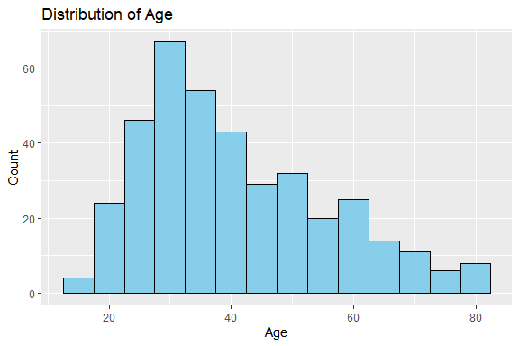
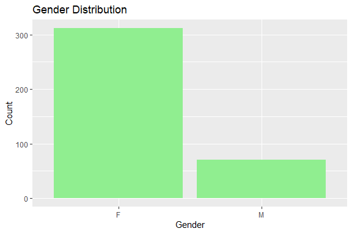
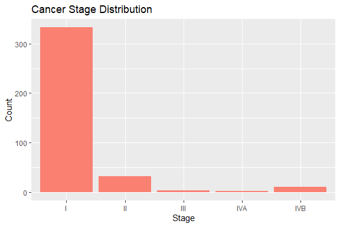
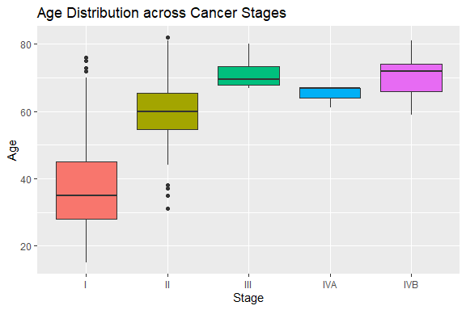
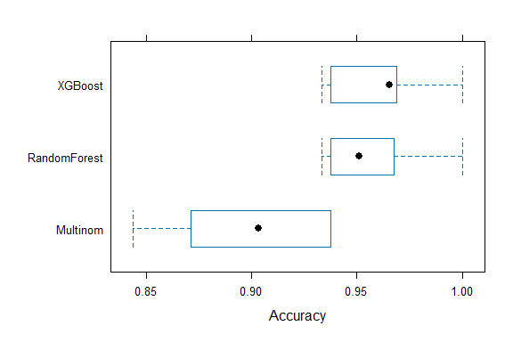
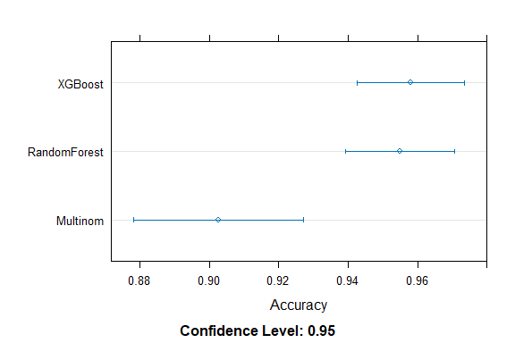
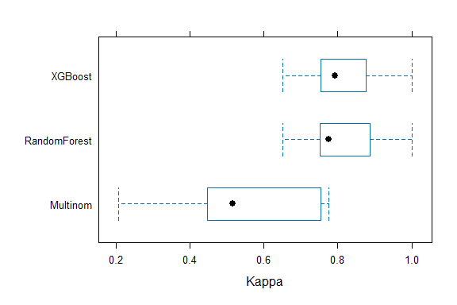
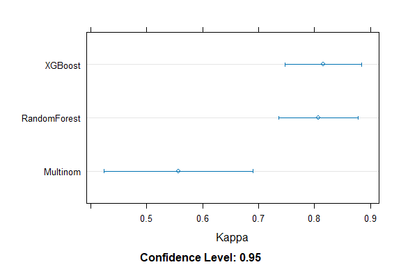

Thyroid Cancer Prediction
================
Trevor Okinda
2024

- [Student Details](#student-details)
- [Setup Chunk](#setup-chunk)
  - [Source:](#source)
  - [Reference:](#reference)
- [Understanding the Dataset (Exploratory Data Analysis
  (EDA))](#understanding-the-dataset-exploratory-data-analysis-eda)
  - [Loading the Dataset](#loading-the-dataset)
  - [Measures of Frequency](#measures-of-frequency)
  - [Measures of Central Tendency](#measures-of-central-tendency)
  - [Measures of Distribution](#measures-of-distribution)
  - [ANOVA](#anova)
  - [Plots](#plots)
- [Preprocessing & Data
  Transformation](#preprocessing--data-transformation)
  - [Missing Values](#missing-values)
- [Training Model](#training-model)
  - [Data Splitting](#data-splitting)
  - [Bootstrapping](#bootstrapping)
  - [Cross-validation](#cross-validation)
  - [Training Different Models](#training-different-models)
  - [Performance Comparison using
    Resamples](#performance-comparison-using-resamples)

# Student Details

|                       |                           |
|-----------------------|---------------------------|
| **Student ID Number** | 134780                    |
| **Student Name**      | Trevor Okinda             |
| **BBIT 4.2 Group**    | C                         |
| **Project Name**      | Thyroid Cancer Prediction |

# Setup Chunk

**Note:** the following KnitR options have been set as the global
defaults: <BR>
`knitr::opts_chunk$set(echo = TRUE, warning = FALSE, eval = TRUE, collapse = FALSE, tidy = TRUE)`.

More KnitR options are documented here
<https://bookdown.org/yihui/rmarkdown-cookbook/chunk-options.html> and
here <https://yihui.org/knitr/options/>.

### Source:

The dataset that was used can be downloaded here: *\<<a
href="https://www.kaggle.com/datasets/zaraavagyan/weathercsv/discussion\"
class="uri">https://www.kaggle.com/datasets/zaraavagyan/weathercsv/discussion\</a>\>*

### Reference:

*\<Avagyan, Z. (2017). Weather CSV \[Data set\]. Kaggle.
<a href="https://www.kaggle.com/datasets/zaraavagyan/weathercsv\"
class="uri">https://www.kaggle.com/datasets/zaraavagyan/weathercsv\</a>\>  
Refer to the APA 7th edition manual for rules on how to cite datasets:
<https://apastyle.apa.org/style-grammar-guidelines/references/examples/data-set-references>*

# Understanding the Dataset (Exploratory Data Analysis (EDA))

## Loading the Dataset

``` r
# Load dataset using read.csv
ThyroidCancerData <- read.csv("thyroid_dataset.csv", colClasses = c(
  Age = "numeric",
  Gender = "factor",
  Smoking = "factor",
  Hx_Smoking = "factor",
  Hx_Radiothreapy = "factor",
  Thyroid_Function = "factor",
  Physical_Examination = "factor",
  Adenopathy = "factor",
  Pathology = "factor",
  Focality = "factor",
  Risk = "factor",
  T = "factor",
  N = "factor",
  M = "factor",
  Stage = "factor",
  Response = "factor",
  Recurred = "factor"
))

# Preview the structure and a few rows
str(ThyroidCancerData)
```

    ## 'data.frame':    383 obs. of  17 variables:
    ##  $ Age                 : num  27 34 30 62 62 52 41 46 51 40 ...
    ##  $ Gender              : Factor w/ 2 levels "F","M": 1 1 1 1 1 2 1 1 1 1 ...
    ##  $ Smoking             : Factor w/ 2 levels "No","Yes": 1 1 1 1 1 2 1 1 1 1 ...
    ##  $ Hx_Smoking          : Factor w/ 2 levels "No","Yes": 1 2 1 1 1 1 2 1 1 1 ...
    ##  $ Hx_Radiothreapy     : Factor w/ 2 levels "No","Yes": 1 1 1 1 1 1 1 1 1 1 ...
    ##  $ Thyroid_Function    : Factor w/ 5 levels "Clinical Hyperthyroidism",..: 3 3 3 3 3 3 1 3 3 3 ...
    ##  $ Physical_Examination: Factor w/ 5 levels "Diffuse goiter",..: 4 2 5 5 2 2 5 5 5 5 ...
    ##  $ Adenopathy          : Factor w/ 6 levels "Bilateral","Extensive",..: 4 4 4 4 4 4 4 4 4 4 ...
    ##  $ Pathology           : Factor w/ 4 levels "Follicular","Hurthel cell",..: 3 3 3 3 3 3 3 3 3 3 ...
    ##  $ Focality            : Factor w/ 2 levels "Multi-Focal",..: 2 2 2 2 1 1 2 2 2 2 ...
    ##  $ Risk                : Factor w/ 3 levels "High","Intermediate",..: 3 3 3 3 3 3 3 3 3 3 ...
    ##  $ T                   : Factor w/ 7 levels "T1a","T1b","T2",..: 1 1 1 1 1 1 1 1 1 1 ...
    ##  $ N                   : Factor w/ 3 levels "N0","N1a","N1b": 1 1 1 1 1 1 1 1 1 1 ...
    ##  $ M                   : Factor w/ 2 levels "M0","M1": 1 1 1 1 1 1 1 1 1 1 ...
    ##  $ Stage               : Factor w/ 5 levels "I","II","III",..: 1 1 1 1 1 1 1 1 1 1 ...
    ##  $ Response            : Factor w/ 4 levels "Biochemical Incomplete",..: 3 2 2 2 2 3 2 2 2 2 ...
    ##  $ Recurred            : Factor w/ 2 levels "No","Yes": 1 1 1 1 1 1 1 1 1 1 ...

``` r
head(ThyroidCancerData)
```

    ##   Age Gender Smoking Hx_Smoking Hx_Radiothreapy Thyroid_Function
    ## 1  27      F      No         No              No        Euthyroid
    ## 2  34      F      No        Yes              No        Euthyroid
    ## 3  30      F      No         No              No        Euthyroid
    ## 4  62      F      No         No              No        Euthyroid
    ## 5  62      F      No         No              No        Euthyroid
    ## 6  52      M     Yes         No              No        Euthyroid
    ##          Physical_Examination Adenopathy      Pathology    Focality Risk   T  N
    ## 1  Single nodular goiter-left         No Micropapillary   Uni-Focal  Low T1a N0
    ## 2         Multinodular goiter         No Micropapillary   Uni-Focal  Low T1a N0
    ## 3 Single nodular goiter-right         No Micropapillary   Uni-Focal  Low T1a N0
    ## 4 Single nodular goiter-right         No Micropapillary   Uni-Focal  Low T1a N0
    ## 5         Multinodular goiter         No Micropapillary Multi-Focal  Low T1a N0
    ## 6         Multinodular goiter         No Micropapillary Multi-Focal  Low T1a N0
    ##    M Stage      Response Recurred
    ## 1 M0     I Indeterminate       No
    ## 2 M0     I     Excellent       No
    ## 3 M0     I     Excellent       No
    ## 4 M0     I     Excellent       No
    ## 5 M0     I     Excellent       No
    ## 6 M0     I Indeterminate       No

``` r
View(ThyroidCancerData)
```

## Measures of Frequency

``` r
# Measures of Frequency
# Frequency tables for categorical variables
table(ThyroidCancerData$Gender)
```

    ## 
    ##   F   M 
    ## 312  71

``` r
table(ThyroidCancerData$Smoking)
```

    ## 
    ##  No Yes 
    ## 334  49

``` r
table(ThyroidCancerData$Hx_Smoking)
```

    ## 
    ##  No Yes 
    ## 355  28

``` r
table(ThyroidCancerData$Hx_Radiothreapy)
```

    ## 
    ##  No Yes 
    ## 376   7

``` r
table(ThyroidCancerData$Thyroid_Function)
```

    ## 
    ##    Clinical Hyperthyroidism     Clinical Hypothyroidism 
    ##                          20                          12 
    ##                   Euthyroid Subclinical Hyperthyroidism 
    ##                         332                           5 
    ##  Subclinical Hypothyroidism 
    ##                          14

``` r
table(ThyroidCancerData$Physical_Examination)
```

    ## 
    ##              Diffuse goiter         Multinodular goiter 
    ##                           7                         140 
    ##                      Normal  Single nodular goiter-left 
    ##                           7                          89 
    ## Single nodular goiter-right 
    ##                         140

``` r
table(ThyroidCancerData$Adenopathy)
```

    ## 
    ## Bilateral Extensive      Left        No Posterior     Right 
    ##        32         7        17       277         2        48

``` r
table(ThyroidCancerData$Pathology)
```

    ## 
    ##     Follicular   Hurthel cell Micropapillary      Papillary 
    ##             28             20             48            287

``` r
table(ThyroidCancerData$Focality)
```

    ## 
    ## Multi-Focal   Uni-Focal 
    ##         136         247

``` r
table(ThyroidCancerData$Risk)
```

    ## 
    ##         High Intermediate          Low 
    ##           32          102          249

``` r
table(ThyroidCancerData$Stage)
```

    ## 
    ##   I  II III IVA IVB 
    ## 333  32   4   3  11

``` r
table(ThyroidCancerData$Response)
```

    ## 
    ## Biochemical Incomplete              Excellent          Indeterminate 
    ##                     23                    208                     61 
    ##  Structural Incomplete 
    ##                     91

``` r
table(ThyroidCancerData$Recurred)
```

    ## 
    ##  No Yes 
    ## 275 108

## Measures of Central Tendency

``` r
# Measures of Central Tendency
# Mean, Median, Mode (custom function) for Age
mean(ThyroidCancerData$Age)
```

    ## [1] 40.86684

``` r
median(ThyroidCancerData$Age)
```

    ## [1] 37

``` r
# Mode function
get_mode <- function(v) {
  uniqv <- unique(v)
  uniqv[which.max(tabulate(match(v, uniqv)))]
}
get_mode(ThyroidCancerData$Age)
```

    ## [1] 31

## Measures of Distribution

``` r
# Measures of Central Tendency
# Standard Deviation, Variance, Range, and Summary for Age
sd(ThyroidCancerData$Age)          # Standard deviation
```

    ## [1] 15.13449

``` r
var(ThyroidCancerData$Age)         # Variance
```

    ## [1] 229.0529

``` r
range(ThyroidCancerData$Age)        # Range (min and max)
```

    ## [1] 15 82

``` r
summary(ThyroidCancerData$Age)      # Min, 1st Qu., Median, Mean, 3rd Qu., Max
```

    ##    Min. 1st Qu.  Median    Mean 3rd Qu.    Max. 
    ##   15.00   29.00   37.00   40.87   51.00   82.00

``` r
# Cross-tabulations (example relationships)
table(ThyroidCancerData$Gender, ThyroidCancerData$Stage)
```

    ##    
    ##       I  II III IVA IVB
    ##   F 284  20   2   1   5
    ##   M  49  12   2   2   6

``` r
table(ThyroidCancerData$Smoking, ThyroidCancerData$Stage)
```

    ##      
    ##         I  II III IVA IVB
    ##   No  308  21   1   0   4
    ##   Yes  25  11   3   3   7

``` r
table(ThyroidCancerData$Focality, ThyroidCancerData$Stage)
```

    ##              
    ##                 I  II III IVA IVB
    ##   Multi-Focal  95  25   3   3  10
    ##   Uni-Focal   238   7   1   0   1

``` r
table(ThyroidCancerData$Risk, ThyroidCancerData$Recurred)
```

    ##               
    ##                 No Yes
    ##   High           0  32
    ##   Intermediate  38  64
    ##   Low          237  12

## ANOVA

``` r
# Chi-Square Test between Smoking and Stage
chisq.test(table(ThyroidCancerData$Smoking, ThyroidCancerData$Stage))
```

    ## 
    ##  Pearson's Chi-squared test
    ## 
    ## data:  table(ThyroidCancerData$Smoking, ThyroidCancerData$Stage)
    ## X-squared = 81.508, df = 4, p-value < 2.2e-16

``` r
chisq.test(table(ThyroidCancerData$Gender, ThyroidCancerData$Recurred))
```

    ## 
    ##  Pearson's Chi-squared test with Yates' continuity correction
    ## 
    ## data:  table(ThyroidCancerData$Gender, ThyroidCancerData$Recurred)
    ## X-squared = 39.397, df = 1, p-value = 3.459e-10

``` r
# ANOVA test for Age across different Stages
anova_result <- aov(Age ~ Stage, data = ThyroidCancerData)
summary(anova_result)
```

    ##              Df Sum Sq Mean Sq F value Pr(>F)    
    ## Stage         4  29766    7442   48.72 <2e-16 ***
    ## Residuals   378  57732     153                   
    ## ---
    ## Signif. codes:  0 '***' 0.001 '**' 0.01 '*' 0.05 '.' 0.1 ' ' 1

## Plots

``` r
# Load libraries
library(ggplot2)

# Histogram of Age
ggplot(ThyroidCancerData, aes(x = Age)) +
  geom_histogram(binwidth = 5, fill = "skyblue", color = "black") +
  labs(title = "Distribution of Age", x = "Age", y = "Count")
```

<!-- -->

``` r
# Bar plot for Gender
ggplot(ThyroidCancerData, aes(x = Gender)) +
  geom_bar(fill = "lightgreen") +
  labs(title = "Gender Distribution", x = "Gender", y = "Count")
```

<!-- -->

``` r
# Bar plot for Stage
ggplot(ThyroidCancerData, aes(x = Stage)) +
  geom_bar(fill = "salmon") +
  labs(title = "Cancer Stage Distribution", x = "Stage", y = "Count")
```

<!-- -->

``` r
# Boxplot of Age across Stage
ggplot(ThyroidCancerData, aes(x = Stage, y = Age, fill = Stage)) +
  geom_boxplot() +
  labs(title = "Age Distribution across Cancer Stages", x = "Stage", y = "Age") +
  theme(legend.position = "none")
```

<!-- -->

# Preprocessing & Data Transformation

## Missing Values

``` r
# Check if there are any missing values
any(is.na(ThyroidCancerData))
```

    ## [1] FALSE

``` r
# Summary of missing values per column
colSums(is.na(ThyroidCancerData))
```

    ##                  Age               Gender              Smoking 
    ##                    0                    0                    0 
    ##           Hx_Smoking      Hx_Radiothreapy     Thyroid_Function 
    ##                    0                    0                    0 
    ## Physical_Examination           Adenopathy            Pathology 
    ##                    0                    0                    0 
    ##             Focality                 Risk                    T 
    ##                    0                    0                    0 
    ##                    N                    M                Stage 
    ##                    0                    0                    0 
    ##             Response             Recurred 
    ##                    0                    0

``` r
# Visualize missing values (optional)
# Install if needed: install.packages("Amelia")
library(Amelia)
```

    ## Loading required package: Rcpp

    ## ## 
    ## ## Amelia II: Multiple Imputation
    ## ## (Version 1.8.1, built: 2022-11-18)
    ## ## Copyright (C) 2005-2025 James Honaker, Gary King and Matthew Blackwell
    ## ## Refer to http://gking.harvard.edu/amelia/ for more information
    ## ##

``` r
missmap(ThyroidCancerData, main = "Missing Values Map", col = c("red", "green"), legend = FALSE)
```

<!-- -->

# Training Model

## Data Splitting

``` r
# Load required package
library(caret)
```

    ## Loading required package: lattice

``` r
# Set random seed for reproducibility
set.seed(123)

# Split data: 80% training, 20% testing
trainIndex <- createDataPartition(ThyroidCancerData$Stage, p = 0.8, list = FALSE)

trainData <- ThyroidCancerData[trainIndex, ]
testData <- ThyroidCancerData[-trainIndex, ]

# Check dimensions
dim(trainData)
```

    ## [1] 309  17

``` r
dim(testData)
```

    ## [1] 74 17

## Bootstrapping

``` r
# Set up bootstrapping
set.seed(123)
bootstrap_ctrl <- trainControl(method = "boot", number = 100) # 100 bootstrap resamples

# Example: (We will reuse this when training models)
model_boot <- train(Stage ~ ., data = trainData, method = "rf", trControl = bootstrap_ctrl)

print(model_boot)
```

    ## Random Forest 
    ## 
    ## 309 samples
    ##  16 predictor
    ##   5 classes: 'I', 'II', 'III', 'IVA', 'IVB' 
    ## 
    ## No pre-processing
    ## Resampling: Bootstrapped (100 reps) 
    ## Summary of sample sizes: 309, 309, 309, 309, 309, 309, ... 
    ## Resampling results across tuning parameters:
    ## 
    ##   mtry  Accuracy   Kappa    
    ##    2    0.8708613  0.1528148
    ##   19    0.9490064  0.7870375
    ##   37    0.9494599  0.7889533
    ## 
    ## Accuracy was used to select the optimal model using the largest value.
    ## The final value used for the model was mtry = 37.

## Cross-validation

``` r
# Set up 10-fold cross-validation
set.seed(123)
cv_ctrl <- trainControl(method = "cv", number = 10)  # 10-fold CV

# Example: (we will reuse this for models)
model_cv <- train(Stage ~ ., data = trainData, method = "rf", trControl = cv_ctrl)

print(model_cv)
```

    ## Random Forest 
    ## 
    ## 309 samples
    ##  16 predictor
    ##   5 classes: 'I', 'II', 'III', 'IVA', 'IVB' 
    ## 
    ## No pre-processing
    ## Resampling: Cross-Validated (10 fold) 
    ## Summary of sample sizes: 277, 278, 277, 279, 279, 281, ... 
    ## Resampling results across tuning parameters:
    ## 
    ##   mtry  Accuracy   Kappa    
    ##    2    0.8775883  0.1498377
    ##   19    0.9549837  0.8068333
    ##   37    0.9549837  0.8071420
    ## 
    ## Accuracy was used to select the optimal model using the largest value.
    ## The final value used for the model was mtry = 19.

## Training Different Models

``` r
# Load necessary libraries
library(randomForest)
```

    ## randomForest 4.7-1.1

    ## Type rfNews() to see new features/changes/bug fixes.

    ## 
    ## Attaching package: 'randomForest'

    ## The following object is masked from 'package:ggplot2':
    ## 
    ##     margin

``` r
library(caret)

# Set random seed
set.seed(123)

# Train Random Forest
rf_model <- train(Stage ~ ., 
                  data = trainData,
                  method = "rf",
                  trControl = cv_ctrl)

# Print results
print(rf_model)
```

    ## Random Forest 
    ## 
    ## 309 samples
    ##  16 predictor
    ##   5 classes: 'I', 'II', 'III', 'IVA', 'IVB' 
    ## 
    ## No pre-processing
    ## Resampling: Cross-Validated (10 fold) 
    ## Summary of sample sizes: 277, 278, 277, 279, 279, 281, ... 
    ## Resampling results across tuning parameters:
    ## 
    ##   mtry  Accuracy   Kappa    
    ##    2    0.8775883  0.1498377
    ##   19    0.9549837  0.8068333
    ##   37    0.9549837  0.8071420
    ## 
    ## Accuracy was used to select the optimal model using the largest value.
    ## The final value used for the model was mtry = 19.

``` r
# Load xgboost package
library(xgboost)

# Since xgboost expects numeric data, first ensure factors are properly encoded
# (caret will internally handle this if using train())

# Train XGBoost
set.seed(123)
xgb_model <- train(Stage ~ ., 
                   data = trainData,
                   method = "xgbTree",
                   trControl = cv_ctrl)
```

    ## [17:13:25] WARNING: src/c_api/c_api.cc:935: `ntree_limit` is deprecated, use `iteration_range` instead.
    ## [17:13:25] WARNING: src/c_api/c_api.cc:935: `ntree_limit` is deprecated, use `iteration_range` instead.
    ## [17:13:27] WARNING: src/c_api/c_api.cc:935: `ntree_limit` is deprecated, use `iteration_range` instead.
    ## [17:13:27] WARNING: src/c_api/c_api.cc:935: `ntree_limit` is deprecated, use `iteration_range` instead.
    ## [17:13:29] WARNING: src/c_api/c_api.cc:935: `ntree_limit` is deprecated, use `iteration_range` instead.
    ## [17:13:29] WARNING: src/c_api/c_api.cc:935: `ntree_limit` is deprecated, use `iteration_range` instead.
    ## [17:13:30] WARNING: src/c_api/c_api.cc:935: `ntree_limit` is deprecated, use `iteration_range` instead.
    ## [17:13:30] WARNING: src/c_api/c_api.cc:935: `ntree_limit` is deprecated, use `iteration_range` instead.
    ## [17:13:32] WARNING: src/c_api/c_api.cc:935: `ntree_limit` is deprecated, use `iteration_range` instead.
    ## [17:13:32] WARNING: src/c_api/c_api.cc:935: `ntree_limit` is deprecated, use `iteration_range` instead.
    ## [17:13:33] WARNING: src/c_api/c_api.cc:935: `ntree_limit` is deprecated, use `iteration_range` instead.
    ## [17:13:33] WARNING: src/c_api/c_api.cc:935: `ntree_limit` is deprecated, use `iteration_range` instead.
    ## [17:13:35] WARNING: src/c_api/c_api.cc:935: `ntree_limit` is deprecated, use `iteration_range` instead.
    ## [17:13:35] WARNING: src/c_api/c_api.cc:935: `ntree_limit` is deprecated, use `iteration_range` instead.
    ## [17:13:37] WARNING: src/c_api/c_api.cc:935: `ntree_limit` is deprecated, use `iteration_range` instead.
    ## [17:13:37] WARNING: src/c_api/c_api.cc:935: `ntree_limit` is deprecated, use `iteration_range` instead.
    ## [17:13:39] WARNING: src/c_api/c_api.cc:935: `ntree_limit` is deprecated, use `iteration_range` instead.
    ## [17:13:39] WARNING: src/c_api/c_api.cc:935: `ntree_limit` is deprecated, use `iteration_range` instead.
    ## [17:13:42] WARNING: src/c_api/c_api.cc:935: `ntree_limit` is deprecated, use `iteration_range` instead.
    ## [17:13:42] WARNING: src/c_api/c_api.cc:935: `ntree_limit` is deprecated, use `iteration_range` instead.
    ## [17:13:44] WARNING: src/c_api/c_api.cc:935: `ntree_limit` is deprecated, use `iteration_range` instead.
    ## [17:13:44] WARNING: src/c_api/c_api.cc:935: `ntree_limit` is deprecated, use `iteration_range` instead.
    ## [17:13:46] WARNING: src/c_api/c_api.cc:935: `ntree_limit` is deprecated, use `iteration_range` instead.
    ## [17:13:46] WARNING: src/c_api/c_api.cc:935: `ntree_limit` is deprecated, use `iteration_range` instead.
    ## [17:13:48] WARNING: src/c_api/c_api.cc:935: `ntree_limit` is deprecated, use `iteration_range` instead.
    ## [17:13:48] WARNING: src/c_api/c_api.cc:935: `ntree_limit` is deprecated, use `iteration_range` instead.
    ## [17:13:51] WARNING: src/c_api/c_api.cc:935: `ntree_limit` is deprecated, use `iteration_range` instead.
    ## [17:13:51] WARNING: src/c_api/c_api.cc:935: `ntree_limit` is deprecated, use `iteration_range` instead.
    ## [17:13:54] WARNING: src/c_api/c_api.cc:935: `ntree_limit` is deprecated, use `iteration_range` instead.
    ## [17:13:54] WARNING: src/c_api/c_api.cc:935: `ntree_limit` is deprecated, use `iteration_range` instead.
    ## [17:13:56] WARNING: src/c_api/c_api.cc:935: `ntree_limit` is deprecated, use `iteration_range` instead.
    ## [17:13:56] WARNING: src/c_api/c_api.cc:935: `ntree_limit` is deprecated, use `iteration_range` instead.
    ## [17:13:58] WARNING: src/c_api/c_api.cc:935: `ntree_limit` is deprecated, use `iteration_range` instead.
    ## [17:13:58] WARNING: src/c_api/c_api.cc:935: `ntree_limit` is deprecated, use `iteration_range` instead.
    ## [17:14:00] WARNING: src/c_api/c_api.cc:935: `ntree_limit` is deprecated, use `iteration_range` instead.
    ## [17:14:00] WARNING: src/c_api/c_api.cc:935: `ntree_limit` is deprecated, use `iteration_range` instead.
    ## [17:14:02] WARNING: src/c_api/c_api.cc:935: `ntree_limit` is deprecated, use `iteration_range` instead.
    ## [17:14:02] WARNING: src/c_api/c_api.cc:935: `ntree_limit` is deprecated, use `iteration_range` instead.
    ## [17:14:04] WARNING: src/c_api/c_api.cc:935: `ntree_limit` is deprecated, use `iteration_range` instead.
    ## [17:14:04] WARNING: src/c_api/c_api.cc:935: `ntree_limit` is deprecated, use `iteration_range` instead.
    ## [17:14:05] WARNING: src/c_api/c_api.cc:935: `ntree_limit` is deprecated, use `iteration_range` instead.
    ## [17:14:05] WARNING: src/c_api/c_api.cc:935: `ntree_limit` is deprecated, use `iteration_range` instead.
    ## [17:14:07] WARNING: src/c_api/c_api.cc:935: `ntree_limit` is deprecated, use `iteration_range` instead.
    ## [17:14:07] WARNING: src/c_api/c_api.cc:935: `ntree_limit` is deprecated, use `iteration_range` instead.
    ## [17:14:08] WARNING: src/c_api/c_api.cc:935: `ntree_limit` is deprecated, use `iteration_range` instead.
    ## [17:14:08] WARNING: src/c_api/c_api.cc:935: `ntree_limit` is deprecated, use `iteration_range` instead.
    ## [17:14:09] WARNING: src/c_api/c_api.cc:935: `ntree_limit` is deprecated, use `iteration_range` instead.
    ## [17:14:09] WARNING: src/c_api/c_api.cc:935: `ntree_limit` is deprecated, use `iteration_range` instead.
    ## [17:14:11] WARNING: src/c_api/c_api.cc:935: `ntree_limit` is deprecated, use `iteration_range` instead.
    ## [17:14:11] WARNING: src/c_api/c_api.cc:935: `ntree_limit` is deprecated, use `iteration_range` instead.
    ## [17:14:12] WARNING: src/c_api/c_api.cc:935: `ntree_limit` is deprecated, use `iteration_range` instead.
    ## [17:14:12] WARNING: src/c_api/c_api.cc:935: `ntree_limit` is deprecated, use `iteration_range` instead.
    ## [17:14:14] WARNING: src/c_api/c_api.cc:935: `ntree_limit` is deprecated, use `iteration_range` instead.
    ## [17:14:14] WARNING: src/c_api/c_api.cc:935: `ntree_limit` is deprecated, use `iteration_range` instead.
    ## [17:14:15] WARNING: src/c_api/c_api.cc:935: `ntree_limit` is deprecated, use `iteration_range` instead.
    ## [17:14:15] WARNING: src/c_api/c_api.cc:935: `ntree_limit` is deprecated, use `iteration_range` instead.
    ## [17:14:17] WARNING: src/c_api/c_api.cc:935: `ntree_limit` is deprecated, use `iteration_range` instead.
    ## [17:14:17] WARNING: src/c_api/c_api.cc:935: `ntree_limit` is deprecated, use `iteration_range` instead.
    ## [17:14:20] WARNING: src/c_api/c_api.cc:935: `ntree_limit` is deprecated, use `iteration_range` instead.
    ## [17:14:20] WARNING: src/c_api/c_api.cc:935: `ntree_limit` is deprecated, use `iteration_range` instead.
    ## [17:14:22] WARNING: src/c_api/c_api.cc:935: `ntree_limit` is deprecated, use `iteration_range` instead.
    ## [17:14:22] WARNING: src/c_api/c_api.cc:935: `ntree_limit` is deprecated, use `iteration_range` instead.
    ## [17:14:25] WARNING: src/c_api/c_api.cc:935: `ntree_limit` is deprecated, use `iteration_range` instead.
    ## [17:14:25] WARNING: src/c_api/c_api.cc:935: `ntree_limit` is deprecated, use `iteration_range` instead.
    ## [17:14:27] WARNING: src/c_api/c_api.cc:935: `ntree_limit` is deprecated, use `iteration_range` instead.
    ## [17:14:27] WARNING: src/c_api/c_api.cc:935: `ntree_limit` is deprecated, use `iteration_range` instead.
    ## [17:14:29] WARNING: src/c_api/c_api.cc:935: `ntree_limit` is deprecated, use `iteration_range` instead.
    ## [17:14:29] WARNING: src/c_api/c_api.cc:935: `ntree_limit` is deprecated, use `iteration_range` instead.
    ## [17:14:31] WARNING: src/c_api/c_api.cc:935: `ntree_limit` is deprecated, use `iteration_range` instead.
    ## [17:14:31] WARNING: src/c_api/c_api.cc:935: `ntree_limit` is deprecated, use `iteration_range` instead.
    ## [17:14:33] WARNING: src/c_api/c_api.cc:935: `ntree_limit` is deprecated, use `iteration_range` instead.
    ## [17:14:33] WARNING: src/c_api/c_api.cc:935: `ntree_limit` is deprecated, use `iteration_range` instead.
    ## [17:14:34] WARNING: src/c_api/c_api.cc:935: `ntree_limit` is deprecated, use `iteration_range` instead.
    ## [17:14:34] WARNING: src/c_api/c_api.cc:935: `ntree_limit` is deprecated, use `iteration_range` instead.
    ## [17:14:35] WARNING: src/c_api/c_api.cc:935: `ntree_limit` is deprecated, use `iteration_range` instead.
    ## [17:14:35] WARNING: src/c_api/c_api.cc:935: `ntree_limit` is deprecated, use `iteration_range` instead.
    ## [17:14:36] WARNING: src/c_api/c_api.cc:935: `ntree_limit` is deprecated, use `iteration_range` instead.
    ## [17:14:36] WARNING: src/c_api/c_api.cc:935: `ntree_limit` is deprecated, use `iteration_range` instead.
    ## [17:14:36] WARNING: src/c_api/c_api.cc:935: `ntree_limit` is deprecated, use `iteration_range` instead.
    ## [17:14:36] WARNING: src/c_api/c_api.cc:935: `ntree_limit` is deprecated, use `iteration_range` instead.
    ## [17:14:37] WARNING: src/c_api/c_api.cc:935: `ntree_limit` is deprecated, use `iteration_range` instead.
    ## [17:14:37] WARNING: src/c_api/c_api.cc:935: `ntree_limit` is deprecated, use `iteration_range` instead.
    ## [17:14:38] WARNING: src/c_api/c_api.cc:935: `ntree_limit` is deprecated, use `iteration_range` instead.
    ## [17:14:38] WARNING: src/c_api/c_api.cc:935: `ntree_limit` is deprecated, use `iteration_range` instead.
    ## [17:14:40] WARNING: src/c_api/c_api.cc:935: `ntree_limit` is deprecated, use `iteration_range` instead.
    ## [17:14:40] WARNING: src/c_api/c_api.cc:935: `ntree_limit` is deprecated, use `iteration_range` instead.
    ## [17:14:41] WARNING: src/c_api/c_api.cc:935: `ntree_limit` is deprecated, use `iteration_range` instead.
    ## [17:14:41] WARNING: src/c_api/c_api.cc:935: `ntree_limit` is deprecated, use `iteration_range` instead.
    ## [17:14:43] WARNING: src/c_api/c_api.cc:935: `ntree_limit` is deprecated, use `iteration_range` instead.
    ## [17:14:43] WARNING: src/c_api/c_api.cc:935: `ntree_limit` is deprecated, use `iteration_range` instead.
    ## [17:14:45] WARNING: src/c_api/c_api.cc:935: `ntree_limit` is deprecated, use `iteration_range` instead.
    ## [17:14:45] WARNING: src/c_api/c_api.cc:935: `ntree_limit` is deprecated, use `iteration_range` instead.
    ## [17:14:47] WARNING: src/c_api/c_api.cc:935: `ntree_limit` is deprecated, use `iteration_range` instead.
    ## [17:14:47] WARNING: src/c_api/c_api.cc:935: `ntree_limit` is deprecated, use `iteration_range` instead.
    ## [17:14:48] WARNING: src/c_api/c_api.cc:935: `ntree_limit` is deprecated, use `iteration_range` instead.
    ## [17:14:48] WARNING: src/c_api/c_api.cc:935: `ntree_limit` is deprecated, use `iteration_range` instead.
    ## [17:14:49] WARNING: src/c_api/c_api.cc:935: `ntree_limit` is deprecated, use `iteration_range` instead.
    ## [17:14:49] WARNING: src/c_api/c_api.cc:935: `ntree_limit` is deprecated, use `iteration_range` instead.
    ## [17:14:50] WARNING: src/c_api/c_api.cc:935: `ntree_limit` is deprecated, use `iteration_range` instead.
    ## [17:14:50] WARNING: src/c_api/c_api.cc:935: `ntree_limit` is deprecated, use `iteration_range` instead.
    ## [17:14:52] WARNING: src/c_api/c_api.cc:935: `ntree_limit` is deprecated, use `iteration_range` instead.
    ## [17:14:52] WARNING: src/c_api/c_api.cc:935: `ntree_limit` is deprecated, use `iteration_range` instead.
    ## [17:14:54] WARNING: src/c_api/c_api.cc:935: `ntree_limit` is deprecated, use `iteration_range` instead.
    ## [17:14:54] WARNING: src/c_api/c_api.cc:935: `ntree_limit` is deprecated, use `iteration_range` instead.
    ## [17:14:55] WARNING: src/c_api/c_api.cc:935: `ntree_limit` is deprecated, use `iteration_range` instead.
    ## [17:14:55] WARNING: src/c_api/c_api.cc:935: `ntree_limit` is deprecated, use `iteration_range` instead.
    ## [17:14:57] WARNING: src/c_api/c_api.cc:935: `ntree_limit` is deprecated, use `iteration_range` instead.
    ## [17:14:57] WARNING: src/c_api/c_api.cc:935: `ntree_limit` is deprecated, use `iteration_range` instead.
    ## [17:14:59] WARNING: src/c_api/c_api.cc:935: `ntree_limit` is deprecated, use `iteration_range` instead.
    ## [17:14:59] WARNING: src/c_api/c_api.cc:935: `ntree_limit` is deprecated, use `iteration_range` instead.
    ## [17:15:00] WARNING: src/c_api/c_api.cc:935: `ntree_limit` is deprecated, use `iteration_range` instead.
    ## [17:15:00] WARNING: src/c_api/c_api.cc:935: `ntree_limit` is deprecated, use `iteration_range` instead.
    ## [17:15:01] WARNING: src/c_api/c_api.cc:935: `ntree_limit` is deprecated, use `iteration_range` instead.
    ## [17:15:01] WARNING: src/c_api/c_api.cc:935: `ntree_limit` is deprecated, use `iteration_range` instead.
    ## [17:15:02] WARNING: src/c_api/c_api.cc:935: `ntree_limit` is deprecated, use `iteration_range` instead.
    ## [17:15:02] WARNING: src/c_api/c_api.cc:935: `ntree_limit` is deprecated, use `iteration_range` instead.
    ## [17:15:04] WARNING: src/c_api/c_api.cc:935: `ntree_limit` is deprecated, use `iteration_range` instead.
    ## [17:15:04] WARNING: src/c_api/c_api.cc:935: `ntree_limit` is deprecated, use `iteration_range` instead.
    ## [17:15:05] WARNING: src/c_api/c_api.cc:935: `ntree_limit` is deprecated, use `iteration_range` instead.
    ## [17:15:05] WARNING: src/c_api/c_api.cc:935: `ntree_limit` is deprecated, use `iteration_range` instead.
    ## [17:15:06] WARNING: src/c_api/c_api.cc:935: `ntree_limit` is deprecated, use `iteration_range` instead.
    ## [17:15:06] WARNING: src/c_api/c_api.cc:935: `ntree_limit` is deprecated, use `iteration_range` instead.
    ## [17:15:08] WARNING: src/c_api/c_api.cc:935: `ntree_limit` is deprecated, use `iteration_range` instead.
    ## [17:15:08] WARNING: src/c_api/c_api.cc:935: `ntree_limit` is deprecated, use `iteration_range` instead.
    ## [17:15:10] WARNING: src/c_api/c_api.cc:935: `ntree_limit` is deprecated, use `iteration_range` instead.
    ## [17:15:10] WARNING: src/c_api/c_api.cc:935: `ntree_limit` is deprecated, use `iteration_range` instead.
    ## [17:15:12] WARNING: src/c_api/c_api.cc:935: `ntree_limit` is deprecated, use `iteration_range` instead.
    ## [17:15:12] WARNING: src/c_api/c_api.cc:935: `ntree_limit` is deprecated, use `iteration_range` instead.
    ## [17:15:13] WARNING: src/c_api/c_api.cc:935: `ntree_limit` is deprecated, use `iteration_range` instead.
    ## [17:15:13] WARNING: src/c_api/c_api.cc:935: `ntree_limit` is deprecated, use `iteration_range` instead.
    ## [17:15:15] WARNING: src/c_api/c_api.cc:935: `ntree_limit` is deprecated, use `iteration_range` instead.
    ## [17:15:15] WARNING: src/c_api/c_api.cc:935: `ntree_limit` is deprecated, use `iteration_range` instead.
    ## [17:15:16] WARNING: src/c_api/c_api.cc:935: `ntree_limit` is deprecated, use `iteration_range` instead.
    ## [17:15:16] WARNING: src/c_api/c_api.cc:935: `ntree_limit` is deprecated, use `iteration_range` instead.
    ## [17:15:18] WARNING: src/c_api/c_api.cc:935: `ntree_limit` is deprecated, use `iteration_range` instead.
    ## [17:15:18] WARNING: src/c_api/c_api.cc:935: `ntree_limit` is deprecated, use `iteration_range` instead.
    ## [17:15:19] WARNING: src/c_api/c_api.cc:935: `ntree_limit` is deprecated, use `iteration_range` instead.
    ## [17:15:19] WARNING: src/c_api/c_api.cc:935: `ntree_limit` is deprecated, use `iteration_range` instead.
    ## [17:15:22] WARNING: src/c_api/c_api.cc:935: `ntree_limit` is deprecated, use `iteration_range` instead.
    ## [17:15:22] WARNING: src/c_api/c_api.cc:935: `ntree_limit` is deprecated, use `iteration_range` instead.
    ## [17:15:24] WARNING: src/c_api/c_api.cc:935: `ntree_limit` is deprecated, use `iteration_range` instead.
    ## [17:15:24] WARNING: src/c_api/c_api.cc:935: `ntree_limit` is deprecated, use `iteration_range` instead.
    ## [17:15:26] WARNING: src/c_api/c_api.cc:935: `ntree_limit` is deprecated, use `iteration_range` instead.
    ## [17:15:26] WARNING: src/c_api/c_api.cc:935: `ntree_limit` is deprecated, use `iteration_range` instead.
    ## [17:15:28] WARNING: src/c_api/c_api.cc:935: `ntree_limit` is deprecated, use `iteration_range` instead.
    ## [17:15:28] WARNING: src/c_api/c_api.cc:935: `ntree_limit` is deprecated, use `iteration_range` instead.
    ## [17:15:29] WARNING: src/c_api/c_api.cc:935: `ntree_limit` is deprecated, use `iteration_range` instead.
    ## [17:15:29] WARNING: src/c_api/c_api.cc:935: `ntree_limit` is deprecated, use `iteration_range` instead.
    ## [17:15:31] WARNING: src/c_api/c_api.cc:935: `ntree_limit` is deprecated, use `iteration_range` instead.
    ## [17:15:31] WARNING: src/c_api/c_api.cc:935: `ntree_limit` is deprecated, use `iteration_range` instead.
    ## [17:15:32] WARNING: src/c_api/c_api.cc:935: `ntree_limit` is deprecated, use `iteration_range` instead.
    ## [17:15:32] WARNING: src/c_api/c_api.cc:935: `ntree_limit` is deprecated, use `iteration_range` instead.
    ## [17:15:34] WARNING: src/c_api/c_api.cc:935: `ntree_limit` is deprecated, use `iteration_range` instead.
    ## [17:15:34] WARNING: src/c_api/c_api.cc:935: `ntree_limit` is deprecated, use `iteration_range` instead.
    ## [17:15:35] WARNING: src/c_api/c_api.cc:935: `ntree_limit` is deprecated, use `iteration_range` instead.
    ## [17:15:35] WARNING: src/c_api/c_api.cc:935: `ntree_limit` is deprecated, use `iteration_range` instead.
    ## [17:15:37] WARNING: src/c_api/c_api.cc:935: `ntree_limit` is deprecated, use `iteration_range` instead.
    ## [17:15:37] WARNING: src/c_api/c_api.cc:935: `ntree_limit` is deprecated, use `iteration_range` instead.
    ## [17:15:39] WARNING: src/c_api/c_api.cc:935: `ntree_limit` is deprecated, use `iteration_range` instead.
    ## [17:15:39] WARNING: src/c_api/c_api.cc:935: `ntree_limit` is deprecated, use `iteration_range` instead.
    ## [17:15:41] WARNING: src/c_api/c_api.cc:935: `ntree_limit` is deprecated, use `iteration_range` instead.
    ## [17:15:41] WARNING: src/c_api/c_api.cc:935: `ntree_limit` is deprecated, use `iteration_range` instead.
    ## [17:15:42] WARNING: src/c_api/c_api.cc:935: `ntree_limit` is deprecated, use `iteration_range` instead.
    ## [17:15:42] WARNING: src/c_api/c_api.cc:935: `ntree_limit` is deprecated, use `iteration_range` instead.
    ## [17:15:44] WARNING: src/c_api/c_api.cc:935: `ntree_limit` is deprecated, use `iteration_range` instead.
    ## [17:15:44] WARNING: src/c_api/c_api.cc:935: `ntree_limit` is deprecated, use `iteration_range` instead.
    ## [17:15:46] WARNING: src/c_api/c_api.cc:935: `ntree_limit` is deprecated, use `iteration_range` instead.
    ## [17:15:46] WARNING: src/c_api/c_api.cc:935: `ntree_limit` is deprecated, use `iteration_range` instead.
    ## [17:15:47] WARNING: src/c_api/c_api.cc:935: `ntree_limit` is deprecated, use `iteration_range` instead.
    ## [17:15:47] WARNING: src/c_api/c_api.cc:935: `ntree_limit` is deprecated, use `iteration_range` instead.
    ## [17:15:49] WARNING: src/c_api/c_api.cc:935: `ntree_limit` is deprecated, use `iteration_range` instead.
    ## [17:15:49] WARNING: src/c_api/c_api.cc:935: `ntree_limit` is deprecated, use `iteration_range` instead.
    ## [17:15:51] WARNING: src/c_api/c_api.cc:935: `ntree_limit` is deprecated, use `iteration_range` instead.
    ## [17:15:51] WARNING: src/c_api/c_api.cc:935: `ntree_limit` is deprecated, use `iteration_range` instead.
    ## [17:15:53] WARNING: src/c_api/c_api.cc:935: `ntree_limit` is deprecated, use `iteration_range` instead.
    ## [17:15:53] WARNING: src/c_api/c_api.cc:935: `ntree_limit` is deprecated, use `iteration_range` instead.
    ## [17:15:55] WARNING: src/c_api/c_api.cc:935: `ntree_limit` is deprecated, use `iteration_range` instead.
    ## [17:15:55] WARNING: src/c_api/c_api.cc:935: `ntree_limit` is deprecated, use `iteration_range` instead.
    ## [17:15:57] WARNING: src/c_api/c_api.cc:935: `ntree_limit` is deprecated, use `iteration_range` instead.
    ## [17:15:57] WARNING: src/c_api/c_api.cc:935: `ntree_limit` is deprecated, use `iteration_range` instead.
    ## [17:15:58] WARNING: src/c_api/c_api.cc:935: `ntree_limit` is deprecated, use `iteration_range` instead.
    ## [17:15:58] WARNING: src/c_api/c_api.cc:935: `ntree_limit` is deprecated, use `iteration_range` instead.
    ## [17:16:00] WARNING: src/c_api/c_api.cc:935: `ntree_limit` is deprecated, use `iteration_range` instead.
    ## [17:16:00] WARNING: src/c_api/c_api.cc:935: `ntree_limit` is deprecated, use `iteration_range` instead.
    ## [17:16:01] WARNING: src/c_api/c_api.cc:935: `ntree_limit` is deprecated, use `iteration_range` instead.
    ## [17:16:01] WARNING: src/c_api/c_api.cc:935: `ntree_limit` is deprecated, use `iteration_range` instead.
    ## [17:16:02] WARNING: src/c_api/c_api.cc:935: `ntree_limit` is deprecated, use `iteration_range` instead.
    ## [17:16:02] WARNING: src/c_api/c_api.cc:935: `ntree_limit` is deprecated, use `iteration_range` instead.
    ## [17:16:03] WARNING: src/c_api/c_api.cc:935: `ntree_limit` is deprecated, use `iteration_range` instead.
    ## [17:16:03] WARNING: src/c_api/c_api.cc:935: `ntree_limit` is deprecated, use `iteration_range` instead.
    ## [17:16:05] WARNING: src/c_api/c_api.cc:935: `ntree_limit` is deprecated, use `iteration_range` instead.
    ## [17:16:05] WARNING: src/c_api/c_api.cc:935: `ntree_limit` is deprecated, use `iteration_range` instead.
    ## [17:16:06] WARNING: src/c_api/c_api.cc:935: `ntree_limit` is deprecated, use `iteration_range` instead.
    ## [17:16:06] WARNING: src/c_api/c_api.cc:935: `ntree_limit` is deprecated, use `iteration_range` instead.
    ## [17:16:08] WARNING: src/c_api/c_api.cc:935: `ntree_limit` is deprecated, use `iteration_range` instead.
    ## [17:16:08] WARNING: src/c_api/c_api.cc:935: `ntree_limit` is deprecated, use `iteration_range` instead.
    ## [17:16:09] WARNING: src/c_api/c_api.cc:935: `ntree_limit` is deprecated, use `iteration_range` instead.
    ## [17:16:09] WARNING: src/c_api/c_api.cc:935: `ntree_limit` is deprecated, use `iteration_range` instead.
    ## [17:16:12] WARNING: src/c_api/c_api.cc:935: `ntree_limit` is deprecated, use `iteration_range` instead.
    ## [17:16:12] WARNING: src/c_api/c_api.cc:935: `ntree_limit` is deprecated, use `iteration_range` instead.
    ## [17:16:14] WARNING: src/c_api/c_api.cc:935: `ntree_limit` is deprecated, use `iteration_range` instead.
    ## [17:16:14] WARNING: src/c_api/c_api.cc:935: `ntree_limit` is deprecated, use `iteration_range` instead.
    ## [17:16:16] WARNING: src/c_api/c_api.cc:935: `ntree_limit` is deprecated, use `iteration_range` instead.
    ## [17:16:16] WARNING: src/c_api/c_api.cc:935: `ntree_limit` is deprecated, use `iteration_range` instead.
    ## [17:16:18] WARNING: src/c_api/c_api.cc:935: `ntree_limit` is deprecated, use `iteration_range` instead.
    ## [17:16:18] WARNING: src/c_api/c_api.cc:935: `ntree_limit` is deprecated, use `iteration_range` instead.
    ## [17:16:21] WARNING: src/c_api/c_api.cc:935: `ntree_limit` is deprecated, use `iteration_range` instead.
    ## [17:16:21] WARNING: src/c_api/c_api.cc:935: `ntree_limit` is deprecated, use `iteration_range` instead.
    ## [17:16:23] WARNING: src/c_api/c_api.cc:935: `ntree_limit` is deprecated, use `iteration_range` instead.
    ## [17:16:23] WARNING: src/c_api/c_api.cc:935: `ntree_limit` is deprecated, use `iteration_range` instead.
    ## [17:16:25] WARNING: src/c_api/c_api.cc:935: `ntree_limit` is deprecated, use `iteration_range` instead.
    ## [17:16:25] WARNING: src/c_api/c_api.cc:935: `ntree_limit` is deprecated, use `iteration_range` instead.
    ## [17:16:27] WARNING: src/c_api/c_api.cc:935: `ntree_limit` is deprecated, use `iteration_range` instead.
    ## [17:16:27] WARNING: src/c_api/c_api.cc:935: `ntree_limit` is deprecated, use `iteration_range` instead.
    ## [17:16:29] WARNING: src/c_api/c_api.cc:935: `ntree_limit` is deprecated, use `iteration_range` instead.
    ## [17:16:29] WARNING: src/c_api/c_api.cc:935: `ntree_limit` is deprecated, use `iteration_range` instead.
    ## [17:16:30] WARNING: src/c_api/c_api.cc:935: `ntree_limit` is deprecated, use `iteration_range` instead.
    ## [17:16:30] WARNING: src/c_api/c_api.cc:935: `ntree_limit` is deprecated, use `iteration_range` instead.
    ## [17:16:31] WARNING: src/c_api/c_api.cc:935: `ntree_limit` is deprecated, use `iteration_range` instead.
    ## [17:16:31] WARNING: src/c_api/c_api.cc:935: `ntree_limit` is deprecated, use `iteration_range` instead.
    ## [17:16:32] WARNING: src/c_api/c_api.cc:935: `ntree_limit` is deprecated, use `iteration_range` instead.
    ## [17:16:32] WARNING: src/c_api/c_api.cc:935: `ntree_limit` is deprecated, use `iteration_range` instead.
    ## [17:16:33] WARNING: src/c_api/c_api.cc:935: `ntree_limit` is deprecated, use `iteration_range` instead.
    ## [17:16:33] WARNING: src/c_api/c_api.cc:935: `ntree_limit` is deprecated, use `iteration_range` instead.
    ## [17:16:34] WARNING: src/c_api/c_api.cc:935: `ntree_limit` is deprecated, use `iteration_range` instead.
    ## [17:16:34] WARNING: src/c_api/c_api.cc:935: `ntree_limit` is deprecated, use `iteration_range` instead.
    ## [17:16:36] WARNING: src/c_api/c_api.cc:935: `ntree_limit` is deprecated, use `iteration_range` instead.
    ## [17:16:36] WARNING: src/c_api/c_api.cc:935: `ntree_limit` is deprecated, use `iteration_range` instead.
    ## [17:16:37] WARNING: src/c_api/c_api.cc:935: `ntree_limit` is deprecated, use `iteration_range` instead.
    ## [17:16:37] WARNING: src/c_api/c_api.cc:935: `ntree_limit` is deprecated, use `iteration_range` instead.
    ## [17:16:39] WARNING: src/c_api/c_api.cc:935: `ntree_limit` is deprecated, use `iteration_range` instead.
    ## [17:16:39] WARNING: src/c_api/c_api.cc:935: `ntree_limit` is deprecated, use `iteration_range` instead.
    ## [17:16:40] WARNING: src/c_api/c_api.cc:935: `ntree_limit` is deprecated, use `iteration_range` instead.
    ## [17:16:40] WARNING: src/c_api/c_api.cc:935: `ntree_limit` is deprecated, use `iteration_range` instead.
    ## [17:16:41] WARNING: src/c_api/c_api.cc:935: `ntree_limit` is deprecated, use `iteration_range` instead.
    ## [17:16:41] WARNING: src/c_api/c_api.cc:935: `ntree_limit` is deprecated, use `iteration_range` instead.
    ## [17:16:43] WARNING: src/c_api/c_api.cc:935: `ntree_limit` is deprecated, use `iteration_range` instead.
    ## [17:16:43] WARNING: src/c_api/c_api.cc:935: `ntree_limit` is deprecated, use `iteration_range` instead.
    ## [17:16:45] WARNING: src/c_api/c_api.cc:935: `ntree_limit` is deprecated, use `iteration_range` instead.
    ## [17:16:45] WARNING: src/c_api/c_api.cc:935: `ntree_limit` is deprecated, use `iteration_range` instead.
    ## [17:16:46] WARNING: src/c_api/c_api.cc:935: `ntree_limit` is deprecated, use `iteration_range` instead.
    ## [17:16:46] WARNING: src/c_api/c_api.cc:935: `ntree_limit` is deprecated, use `iteration_range` instead.
    ## [17:16:48] WARNING: src/c_api/c_api.cc:935: `ntree_limit` is deprecated, use `iteration_range` instead.
    ## [17:16:48] WARNING: src/c_api/c_api.cc:935: `ntree_limit` is deprecated, use `iteration_range` instead.
    ## [17:16:49] WARNING: src/c_api/c_api.cc:935: `ntree_limit` is deprecated, use `iteration_range` instead.
    ## [17:16:49] WARNING: src/c_api/c_api.cc:935: `ntree_limit` is deprecated, use `iteration_range` instead.
    ## [17:16:51] WARNING: src/c_api/c_api.cc:935: `ntree_limit` is deprecated, use `iteration_range` instead.
    ## [17:16:51] WARNING: src/c_api/c_api.cc:935: `ntree_limit` is deprecated, use `iteration_range` instead.
    ## [17:16:53] WARNING: src/c_api/c_api.cc:935: `ntree_limit` is deprecated, use `iteration_range` instead.
    ## [17:16:53] WARNING: src/c_api/c_api.cc:935: `ntree_limit` is deprecated, use `iteration_range` instead.
    ## [17:16:54] WARNING: src/c_api/c_api.cc:935: `ntree_limit` is deprecated, use `iteration_range` instead.
    ## [17:16:54] WARNING: src/c_api/c_api.cc:935: `ntree_limit` is deprecated, use `iteration_range` instead.
    ## [17:16:55] WARNING: src/c_api/c_api.cc:935: `ntree_limit` is deprecated, use `iteration_range` instead.
    ## [17:16:56] WARNING: src/c_api/c_api.cc:935: `ntree_limit` is deprecated, use `iteration_range` instead.
    ## [17:16:57] WARNING: src/c_api/c_api.cc:935: `ntree_limit` is deprecated, use `iteration_range` instead.
    ## [17:16:57] WARNING: src/c_api/c_api.cc:935: `ntree_limit` is deprecated, use `iteration_range` instead.
    ## [17:16:58] WARNING: src/c_api/c_api.cc:935: `ntree_limit` is deprecated, use `iteration_range` instead.
    ## [17:16:58] WARNING: src/c_api/c_api.cc:935: `ntree_limit` is deprecated, use `iteration_range` instead.
    ## [17:16:59] WARNING: src/c_api/c_api.cc:935: `ntree_limit` is deprecated, use `iteration_range` instead.
    ## [17:16:59] WARNING: src/c_api/c_api.cc:935: `ntree_limit` is deprecated, use `iteration_range` instead.
    ## [17:17:00] WARNING: src/c_api/c_api.cc:935: `ntree_limit` is deprecated, use `iteration_range` instead.
    ## [17:17:00] WARNING: src/c_api/c_api.cc:935: `ntree_limit` is deprecated, use `iteration_range` instead.
    ## [17:17:01] WARNING: src/c_api/c_api.cc:935: `ntree_limit` is deprecated, use `iteration_range` instead.
    ## [17:17:01] WARNING: src/c_api/c_api.cc:935: `ntree_limit` is deprecated, use `iteration_range` instead.
    ## [17:17:02] WARNING: src/c_api/c_api.cc:935: `ntree_limit` is deprecated, use `iteration_range` instead.
    ## [17:17:02] WARNING: src/c_api/c_api.cc:935: `ntree_limit` is deprecated, use `iteration_range` instead.
    ## [17:17:03] WARNING: src/c_api/c_api.cc:935: `ntree_limit` is deprecated, use `iteration_range` instead.
    ## [17:17:03] WARNING: src/c_api/c_api.cc:935: `ntree_limit` is deprecated, use `iteration_range` instead.
    ## [17:17:05] WARNING: src/c_api/c_api.cc:935: `ntree_limit` is deprecated, use `iteration_range` instead.
    ## [17:17:05] WARNING: src/c_api/c_api.cc:935: `ntree_limit` is deprecated, use `iteration_range` instead.
    ## [17:17:07] WARNING: src/c_api/c_api.cc:935: `ntree_limit` is deprecated, use `iteration_range` instead.
    ## [17:17:07] WARNING: src/c_api/c_api.cc:935: `ntree_limit` is deprecated, use `iteration_range` instead.
    ## [17:17:09] WARNING: src/c_api/c_api.cc:935: `ntree_limit` is deprecated, use `iteration_range` instead.
    ## [17:17:09] WARNING: src/c_api/c_api.cc:935: `ntree_limit` is deprecated, use `iteration_range` instead.
    ## [17:17:11] WARNING: src/c_api/c_api.cc:935: `ntree_limit` is deprecated, use `iteration_range` instead.
    ## [17:17:11] WARNING: src/c_api/c_api.cc:935: `ntree_limit` is deprecated, use `iteration_range` instead.
    ## [17:17:12] WARNING: src/c_api/c_api.cc:935: `ntree_limit` is deprecated, use `iteration_range` instead.
    ## [17:17:12] WARNING: src/c_api/c_api.cc:935: `ntree_limit` is deprecated, use `iteration_range` instead.
    ## [17:17:14] WARNING: src/c_api/c_api.cc:935: `ntree_limit` is deprecated, use `iteration_range` instead.
    ## [17:17:14] WARNING: src/c_api/c_api.cc:935: `ntree_limit` is deprecated, use `iteration_range` instead.
    ## [17:17:15] WARNING: src/c_api/c_api.cc:935: `ntree_limit` is deprecated, use `iteration_range` instead.
    ## [17:17:15] WARNING: src/c_api/c_api.cc:935: `ntree_limit` is deprecated, use `iteration_range` instead.
    ## [17:17:17] WARNING: src/c_api/c_api.cc:935: `ntree_limit` is deprecated, use `iteration_range` instead.
    ## [17:17:17] WARNING: src/c_api/c_api.cc:935: `ntree_limit` is deprecated, use `iteration_range` instead.
    ## [17:17:19] WARNING: src/c_api/c_api.cc:935: `ntree_limit` is deprecated, use `iteration_range` instead.
    ## [17:17:19] WARNING: src/c_api/c_api.cc:935: `ntree_limit` is deprecated, use `iteration_range` instead.
    ## [17:17:21] WARNING: src/c_api/c_api.cc:935: `ntree_limit` is deprecated, use `iteration_range` instead.
    ## [17:17:21] WARNING: src/c_api/c_api.cc:935: `ntree_limit` is deprecated, use `iteration_range` instead.
    ## [17:17:22] WARNING: src/c_api/c_api.cc:935: `ntree_limit` is deprecated, use `iteration_range` instead.
    ## [17:17:22] WARNING: src/c_api/c_api.cc:935: `ntree_limit` is deprecated, use `iteration_range` instead.
    ## [17:17:24] WARNING: src/c_api/c_api.cc:935: `ntree_limit` is deprecated, use `iteration_range` instead.
    ## [17:17:24] WARNING: src/c_api/c_api.cc:935: `ntree_limit` is deprecated, use `iteration_range` instead.
    ## [17:17:26] WARNING: src/c_api/c_api.cc:935: `ntree_limit` is deprecated, use `iteration_range` instead.
    ## [17:17:26] WARNING: src/c_api/c_api.cc:935: `ntree_limit` is deprecated, use `iteration_range` instead.
    ## [17:17:27] WARNING: src/c_api/c_api.cc:935: `ntree_limit` is deprecated, use `iteration_range` instead.
    ## [17:17:27] WARNING: src/c_api/c_api.cc:935: `ntree_limit` is deprecated, use `iteration_range` instead.
    ## [17:17:29] WARNING: src/c_api/c_api.cc:935: `ntree_limit` is deprecated, use `iteration_range` instead.
    ## [17:17:29] WARNING: src/c_api/c_api.cc:935: `ntree_limit` is deprecated, use `iteration_range` instead.
    ## [17:17:30] WARNING: src/c_api/c_api.cc:935: `ntree_limit` is deprecated, use `iteration_range` instead.
    ## [17:17:30] WARNING: src/c_api/c_api.cc:935: `ntree_limit` is deprecated, use `iteration_range` instead.
    ## [17:17:32] WARNING: src/c_api/c_api.cc:935: `ntree_limit` is deprecated, use `iteration_range` instead.
    ## [17:17:32] WARNING: src/c_api/c_api.cc:935: `ntree_limit` is deprecated, use `iteration_range` instead.
    ## [17:17:34] WARNING: src/c_api/c_api.cc:935: `ntree_limit` is deprecated, use `iteration_range` instead.
    ## [17:17:34] WARNING: src/c_api/c_api.cc:935: `ntree_limit` is deprecated, use `iteration_range` instead.
    ## [17:17:36] WARNING: src/c_api/c_api.cc:935: `ntree_limit` is deprecated, use `iteration_range` instead.
    ## [17:17:36] WARNING: src/c_api/c_api.cc:935: `ntree_limit` is deprecated, use `iteration_range` instead.
    ## [17:17:38] WARNING: src/c_api/c_api.cc:935: `ntree_limit` is deprecated, use `iteration_range` instead.
    ## [17:17:38] WARNING: src/c_api/c_api.cc:935: `ntree_limit` is deprecated, use `iteration_range` instead.
    ## [17:17:41] WARNING: src/c_api/c_api.cc:935: `ntree_limit` is deprecated, use `iteration_range` instead.
    ## [17:17:41] WARNING: src/c_api/c_api.cc:935: `ntree_limit` is deprecated, use `iteration_range` instead.
    ## [17:17:43] WARNING: src/c_api/c_api.cc:935: `ntree_limit` is deprecated, use `iteration_range` instead.
    ## [17:17:43] WARNING: src/c_api/c_api.cc:935: `ntree_limit` is deprecated, use `iteration_range` instead.
    ## [17:17:45] WARNING: src/c_api/c_api.cc:935: `ntree_limit` is deprecated, use `iteration_range` instead.
    ## [17:17:45] WARNING: src/c_api/c_api.cc:935: `ntree_limit` is deprecated, use `iteration_range` instead.
    ## [17:17:47] WARNING: src/c_api/c_api.cc:935: `ntree_limit` is deprecated, use `iteration_range` instead.
    ## [17:17:47] WARNING: src/c_api/c_api.cc:935: `ntree_limit` is deprecated, use `iteration_range` instead.
    ## [17:17:49] WARNING: src/c_api/c_api.cc:935: `ntree_limit` is deprecated, use `iteration_range` instead.
    ## [17:17:49] WARNING: src/c_api/c_api.cc:935: `ntree_limit` is deprecated, use `iteration_range` instead.
    ## [17:17:51] WARNING: src/c_api/c_api.cc:935: `ntree_limit` is deprecated, use `iteration_range` instead.
    ## [17:17:51] WARNING: src/c_api/c_api.cc:935: `ntree_limit` is deprecated, use `iteration_range` instead.
    ## [17:17:53] WARNING: src/c_api/c_api.cc:935: `ntree_limit` is deprecated, use `iteration_range` instead.
    ## [17:17:53] WARNING: src/c_api/c_api.cc:935: `ntree_limit` is deprecated, use `iteration_range` instead.
    ## [17:17:56] WARNING: src/c_api/c_api.cc:935: `ntree_limit` is deprecated, use `iteration_range` instead.
    ## [17:17:56] WARNING: src/c_api/c_api.cc:935: `ntree_limit` is deprecated, use `iteration_range` instead.
    ## [17:17:57] WARNING: src/c_api/c_api.cc:935: `ntree_limit` is deprecated, use `iteration_range` instead.
    ## [17:17:57] WARNING: src/c_api/c_api.cc:935: `ntree_limit` is deprecated, use `iteration_range` instead.
    ## [17:17:58] WARNING: src/c_api/c_api.cc:935: `ntree_limit` is deprecated, use `iteration_range` instead.
    ## [17:17:58] WARNING: src/c_api/c_api.cc:935: `ntree_limit` is deprecated, use `iteration_range` instead.
    ## [17:17:59] WARNING: src/c_api/c_api.cc:935: `ntree_limit` is deprecated, use `iteration_range` instead.
    ## [17:17:59] WARNING: src/c_api/c_api.cc:935: `ntree_limit` is deprecated, use `iteration_range` instead.
    ## [17:18:01] WARNING: src/c_api/c_api.cc:935: `ntree_limit` is deprecated, use `iteration_range` instead.
    ## [17:18:01] WARNING: src/c_api/c_api.cc:935: `ntree_limit` is deprecated, use `iteration_range` instead.
    ## [17:18:02] WARNING: src/c_api/c_api.cc:935: `ntree_limit` is deprecated, use `iteration_range` instead.
    ## [17:18:02] WARNING: src/c_api/c_api.cc:935: `ntree_limit` is deprecated, use `iteration_range` instead.
    ## [17:18:03] WARNING: src/c_api/c_api.cc:935: `ntree_limit` is deprecated, use `iteration_range` instead.
    ## [17:18:03] WARNING: src/c_api/c_api.cc:935: `ntree_limit` is deprecated, use `iteration_range` instead.
    ## [17:18:05] WARNING: src/c_api/c_api.cc:935: `ntree_limit` is deprecated, use `iteration_range` instead.
    ## [17:18:05] WARNING: src/c_api/c_api.cc:935: `ntree_limit` is deprecated, use `iteration_range` instead.
    ## [17:18:07] WARNING: src/c_api/c_api.cc:935: `ntree_limit` is deprecated, use `iteration_range` instead.
    ## [17:18:07] WARNING: src/c_api/c_api.cc:935: `ntree_limit` is deprecated, use `iteration_range` instead.
    ## [17:18:09] WARNING: src/c_api/c_api.cc:935: `ntree_limit` is deprecated, use `iteration_range` instead.
    ## [17:18:09] WARNING: src/c_api/c_api.cc:935: `ntree_limit` is deprecated, use `iteration_range` instead.
    ## [17:18:11] WARNING: src/c_api/c_api.cc:935: `ntree_limit` is deprecated, use `iteration_range` instead.
    ## [17:18:11] WARNING: src/c_api/c_api.cc:935: `ntree_limit` is deprecated, use `iteration_range` instead.
    ## [17:18:13] WARNING: src/c_api/c_api.cc:935: `ntree_limit` is deprecated, use `iteration_range` instead.
    ## [17:18:13] WARNING: src/c_api/c_api.cc:935: `ntree_limit` is deprecated, use `iteration_range` instead.
    ## [17:18:15] WARNING: src/c_api/c_api.cc:935: `ntree_limit` is deprecated, use `iteration_range` instead.
    ## [17:18:15] WARNING: src/c_api/c_api.cc:935: `ntree_limit` is deprecated, use `iteration_range` instead.
    ## [17:18:17] WARNING: src/c_api/c_api.cc:935: `ntree_limit` is deprecated, use `iteration_range` instead.
    ## [17:18:17] WARNING: src/c_api/c_api.cc:935: `ntree_limit` is deprecated, use `iteration_range` instead.
    ## [17:18:19] WARNING: src/c_api/c_api.cc:935: `ntree_limit` is deprecated, use `iteration_range` instead.
    ## [17:18:19] WARNING: src/c_api/c_api.cc:935: `ntree_limit` is deprecated, use `iteration_range` instead.
    ## [17:18:21] WARNING: src/c_api/c_api.cc:935: `ntree_limit` is deprecated, use `iteration_range` instead.
    ## [17:18:21] WARNING: src/c_api/c_api.cc:935: `ntree_limit` is deprecated, use `iteration_range` instead.
    ## [17:18:23] WARNING: src/c_api/c_api.cc:935: `ntree_limit` is deprecated, use `iteration_range` instead.
    ## [17:18:23] WARNING: src/c_api/c_api.cc:935: `ntree_limit` is deprecated, use `iteration_range` instead.
    ## [17:18:25] WARNING: src/c_api/c_api.cc:935: `ntree_limit` is deprecated, use `iteration_range` instead.
    ## [17:18:25] WARNING: src/c_api/c_api.cc:935: `ntree_limit` is deprecated, use `iteration_range` instead.
    ## [17:18:27] WARNING: src/c_api/c_api.cc:935: `ntree_limit` is deprecated, use `iteration_range` instead.
    ## [17:18:27] WARNING: src/c_api/c_api.cc:935: `ntree_limit` is deprecated, use `iteration_range` instead.
    ## [17:18:29] WARNING: src/c_api/c_api.cc:935: `ntree_limit` is deprecated, use `iteration_range` instead.
    ## [17:18:29] WARNING: src/c_api/c_api.cc:935: `ntree_limit` is deprecated, use `iteration_range` instead.
    ## [17:18:30] WARNING: src/c_api/c_api.cc:935: `ntree_limit` is deprecated, use `iteration_range` instead.
    ## [17:18:30] WARNING: src/c_api/c_api.cc:935: `ntree_limit` is deprecated, use `iteration_range` instead.
    ## [17:18:32] WARNING: src/c_api/c_api.cc:935: `ntree_limit` is deprecated, use `iteration_range` instead.
    ## [17:18:32] WARNING: src/c_api/c_api.cc:935: `ntree_limit` is deprecated, use `iteration_range` instead.
    ## [17:18:33] WARNING: src/c_api/c_api.cc:935: `ntree_limit` is deprecated, use `iteration_range` instead.
    ## [17:18:33] WARNING: src/c_api/c_api.cc:935: `ntree_limit` is deprecated, use `iteration_range` instead.
    ## [17:18:34] WARNING: src/c_api/c_api.cc:935: `ntree_limit` is deprecated, use `iteration_range` instead.
    ## [17:18:35] WARNING: src/c_api/c_api.cc:935: `ntree_limit` is deprecated, use `iteration_range` instead.
    ## [17:18:36] WARNING: src/c_api/c_api.cc:935: `ntree_limit` is deprecated, use `iteration_range` instead.
    ## [17:18:36] WARNING: src/c_api/c_api.cc:935: `ntree_limit` is deprecated, use `iteration_range` instead.
    ## [17:18:38] WARNING: src/c_api/c_api.cc:935: `ntree_limit` is deprecated, use `iteration_range` instead.
    ## [17:18:38] WARNING: src/c_api/c_api.cc:935: `ntree_limit` is deprecated, use `iteration_range` instead.
    ## [17:18:40] WARNING: src/c_api/c_api.cc:935: `ntree_limit` is deprecated, use `iteration_range` instead.
    ## [17:18:40] WARNING: src/c_api/c_api.cc:935: `ntree_limit` is deprecated, use `iteration_range` instead.
    ## [17:18:41] WARNING: src/c_api/c_api.cc:935: `ntree_limit` is deprecated, use `iteration_range` instead.
    ## [17:18:41] WARNING: src/c_api/c_api.cc:935: `ntree_limit` is deprecated, use `iteration_range` instead.
    ## [17:18:44] WARNING: src/c_api/c_api.cc:935: `ntree_limit` is deprecated, use `iteration_range` instead.
    ## [17:18:44] WARNING: src/c_api/c_api.cc:935: `ntree_limit` is deprecated, use `iteration_range` instead.
    ## [17:18:46] WARNING: src/c_api/c_api.cc:935: `ntree_limit` is deprecated, use `iteration_range` instead.
    ## [17:18:46] WARNING: src/c_api/c_api.cc:935: `ntree_limit` is deprecated, use `iteration_range` instead.
    ## [17:18:48] WARNING: src/c_api/c_api.cc:935: `ntree_limit` is deprecated, use `iteration_range` instead.
    ## [17:18:48] WARNING: src/c_api/c_api.cc:935: `ntree_limit` is deprecated, use `iteration_range` instead.
    ## [17:18:50] WARNING: src/c_api/c_api.cc:935: `ntree_limit` is deprecated, use `iteration_range` instead.
    ## [17:18:50] WARNING: src/c_api/c_api.cc:935: `ntree_limit` is deprecated, use `iteration_range` instead.
    ## [17:18:52] WARNING: src/c_api/c_api.cc:935: `ntree_limit` is deprecated, use `iteration_range` instead.
    ## [17:18:52] WARNING: src/c_api/c_api.cc:935: `ntree_limit` is deprecated, use `iteration_range` instead.
    ## [17:18:55] WARNING: src/c_api/c_api.cc:935: `ntree_limit` is deprecated, use `iteration_range` instead.
    ## [17:18:55] WARNING: src/c_api/c_api.cc:935: `ntree_limit` is deprecated, use `iteration_range` instead.
    ## [17:18:56] WARNING: src/c_api/c_api.cc:935: `ntree_limit` is deprecated, use `iteration_range` instead.
    ## [17:18:56] WARNING: src/c_api/c_api.cc:935: `ntree_limit` is deprecated, use `iteration_range` instead.
    ## [17:18:59] WARNING: src/c_api/c_api.cc:935: `ntree_limit` is deprecated, use `iteration_range` instead.
    ## [17:18:59] WARNING: src/c_api/c_api.cc:935: `ntree_limit` is deprecated, use `iteration_range` instead.
    ## [17:19:01] WARNING: src/c_api/c_api.cc:935: `ntree_limit` is deprecated, use `iteration_range` instead.
    ## [17:19:01] WARNING: src/c_api/c_api.cc:935: `ntree_limit` is deprecated, use `iteration_range` instead.
    ## [17:19:02] WARNING: src/c_api/c_api.cc:935: `ntree_limit` is deprecated, use `iteration_range` instead.
    ## [17:19:02] WARNING: src/c_api/c_api.cc:935: `ntree_limit` is deprecated, use `iteration_range` instead.
    ## [17:19:04] WARNING: src/c_api/c_api.cc:935: `ntree_limit` is deprecated, use `iteration_range` instead.
    ## [17:19:04] WARNING: src/c_api/c_api.cc:935: `ntree_limit` is deprecated, use `iteration_range` instead.
    ## [17:19:05] WARNING: src/c_api/c_api.cc:935: `ntree_limit` is deprecated, use `iteration_range` instead.
    ## [17:19:05] WARNING: src/c_api/c_api.cc:935: `ntree_limit` is deprecated, use `iteration_range` instead.
    ## [17:19:06] WARNING: src/c_api/c_api.cc:935: `ntree_limit` is deprecated, use `iteration_range` instead.
    ## [17:19:06] WARNING: src/c_api/c_api.cc:935: `ntree_limit` is deprecated, use `iteration_range` instead.
    ## [17:19:08] WARNING: src/c_api/c_api.cc:935: `ntree_limit` is deprecated, use `iteration_range` instead.
    ## [17:19:08] WARNING: src/c_api/c_api.cc:935: `ntree_limit` is deprecated, use `iteration_range` instead.
    ## [17:19:09] WARNING: src/c_api/c_api.cc:935: `ntree_limit` is deprecated, use `iteration_range` instead.
    ## [17:19:09] WARNING: src/c_api/c_api.cc:935: `ntree_limit` is deprecated, use `iteration_range` instead.
    ## [17:19:11] WARNING: src/c_api/c_api.cc:935: `ntree_limit` is deprecated, use `iteration_range` instead.
    ## [17:19:11] WARNING: src/c_api/c_api.cc:935: `ntree_limit` is deprecated, use `iteration_range` instead.
    ## [17:19:13] WARNING: src/c_api/c_api.cc:935: `ntree_limit` is deprecated, use `iteration_range` instead.
    ## [17:19:13] WARNING: src/c_api/c_api.cc:935: `ntree_limit` is deprecated, use `iteration_range` instead.
    ## [17:19:15] WARNING: src/c_api/c_api.cc:935: `ntree_limit` is deprecated, use `iteration_range` instead.
    ## [17:19:15] WARNING: src/c_api/c_api.cc:935: `ntree_limit` is deprecated, use `iteration_range` instead.
    ## [17:19:16] WARNING: src/c_api/c_api.cc:935: `ntree_limit` is deprecated, use `iteration_range` instead.
    ## [17:19:16] WARNING: src/c_api/c_api.cc:935: `ntree_limit` is deprecated, use `iteration_range` instead.
    ## [17:19:18] WARNING: src/c_api/c_api.cc:935: `ntree_limit` is deprecated, use `iteration_range` instead.
    ## [17:19:18] WARNING: src/c_api/c_api.cc:935: `ntree_limit` is deprecated, use `iteration_range` instead.
    ## [17:19:21] WARNING: src/c_api/c_api.cc:935: `ntree_limit` is deprecated, use `iteration_range` instead.
    ## [17:19:21] WARNING: src/c_api/c_api.cc:935: `ntree_limit` is deprecated, use `iteration_range` instead.
    ## [17:19:23] WARNING: src/c_api/c_api.cc:935: `ntree_limit` is deprecated, use `iteration_range` instead.
    ## [17:19:23] WARNING: src/c_api/c_api.cc:935: `ntree_limit` is deprecated, use `iteration_range` instead.
    ## [17:19:24] WARNING: src/c_api/c_api.cc:935: `ntree_limit` is deprecated, use `iteration_range` instead.
    ## [17:19:24] WARNING: src/c_api/c_api.cc:935: `ntree_limit` is deprecated, use `iteration_range` instead.
    ## [17:19:27] WARNING: src/c_api/c_api.cc:935: `ntree_limit` is deprecated, use `iteration_range` instead.
    ## [17:19:27] WARNING: src/c_api/c_api.cc:935: `ntree_limit` is deprecated, use `iteration_range` instead.
    ## [17:19:29] WARNING: src/c_api/c_api.cc:935: `ntree_limit` is deprecated, use `iteration_range` instead.
    ## [17:19:29] WARNING: src/c_api/c_api.cc:935: `ntree_limit` is deprecated, use `iteration_range` instead.
    ## [17:19:31] WARNING: src/c_api/c_api.cc:935: `ntree_limit` is deprecated, use `iteration_range` instead.
    ## [17:19:31] WARNING: src/c_api/c_api.cc:935: `ntree_limit` is deprecated, use `iteration_range` instead.
    ## [17:19:33] WARNING: src/c_api/c_api.cc:935: `ntree_limit` is deprecated, use `iteration_range` instead.
    ## [17:19:33] WARNING: src/c_api/c_api.cc:935: `ntree_limit` is deprecated, use `iteration_range` instead.
    ## [17:19:35] WARNING: src/c_api/c_api.cc:935: `ntree_limit` is deprecated, use `iteration_range` instead.
    ## [17:19:35] WARNING: src/c_api/c_api.cc:935: `ntree_limit` is deprecated, use `iteration_range` instead.
    ## [17:19:36] WARNING: src/c_api/c_api.cc:935: `ntree_limit` is deprecated, use `iteration_range` instead.
    ## [17:19:36] WARNING: src/c_api/c_api.cc:935: `ntree_limit` is deprecated, use `iteration_range` instead.
    ## [17:19:37] WARNING: src/c_api/c_api.cc:935: `ntree_limit` is deprecated, use `iteration_range` instead.
    ## [17:19:37] WARNING: src/c_api/c_api.cc:935: `ntree_limit` is deprecated, use `iteration_range` instead.
    ## [17:19:38] WARNING: src/c_api/c_api.cc:935: `ntree_limit` is deprecated, use `iteration_range` instead.
    ## [17:19:38] WARNING: src/c_api/c_api.cc:935: `ntree_limit` is deprecated, use `iteration_range` instead.
    ## [17:19:39] WARNING: src/c_api/c_api.cc:935: `ntree_limit` is deprecated, use `iteration_range` instead.
    ## [17:19:39] WARNING: src/c_api/c_api.cc:935: `ntree_limit` is deprecated, use `iteration_range` instead.
    ## [17:19:40] WARNING: src/c_api/c_api.cc:935: `ntree_limit` is deprecated, use `iteration_range` instead.
    ## [17:19:40] WARNING: src/c_api/c_api.cc:935: `ntree_limit` is deprecated, use `iteration_range` instead.
    ## [17:19:42] WARNING: src/c_api/c_api.cc:935: `ntree_limit` is deprecated, use `iteration_range` instead.
    ## [17:19:42] WARNING: src/c_api/c_api.cc:935: `ntree_limit` is deprecated, use `iteration_range` instead.
    ## [17:19:44] WARNING: src/c_api/c_api.cc:935: `ntree_limit` is deprecated, use `iteration_range` instead.
    ## [17:19:44] WARNING: src/c_api/c_api.cc:935: `ntree_limit` is deprecated, use `iteration_range` instead.
    ## [17:19:46] WARNING: src/c_api/c_api.cc:935: `ntree_limit` is deprecated, use `iteration_range` instead.
    ## [17:19:46] WARNING: src/c_api/c_api.cc:935: `ntree_limit` is deprecated, use `iteration_range` instead.
    ## [17:19:47] WARNING: src/c_api/c_api.cc:935: `ntree_limit` is deprecated, use `iteration_range` instead.
    ## [17:19:47] WARNING: src/c_api/c_api.cc:935: `ntree_limit` is deprecated, use `iteration_range` instead.
    ## [17:19:49] WARNING: src/c_api/c_api.cc:935: `ntree_limit` is deprecated, use `iteration_range` instead.
    ## [17:19:49] WARNING: src/c_api/c_api.cc:935: `ntree_limit` is deprecated, use `iteration_range` instead.
    ## [17:19:51] WARNING: src/c_api/c_api.cc:935: `ntree_limit` is deprecated, use `iteration_range` instead.
    ## [17:19:51] WARNING: src/c_api/c_api.cc:935: `ntree_limit` is deprecated, use `iteration_range` instead.
    ## [17:19:54] WARNING: src/c_api/c_api.cc:935: `ntree_limit` is deprecated, use `iteration_range` instead.
    ## [17:19:54] WARNING: src/c_api/c_api.cc:935: `ntree_limit` is deprecated, use `iteration_range` instead.
    ## [17:19:56] WARNING: src/c_api/c_api.cc:935: `ntree_limit` is deprecated, use `iteration_range` instead.
    ## [17:19:56] WARNING: src/c_api/c_api.cc:935: `ntree_limit` is deprecated, use `iteration_range` instead.
    ## [17:19:58] WARNING: src/c_api/c_api.cc:935: `ntree_limit` is deprecated, use `iteration_range` instead.
    ## [17:19:58] WARNING: src/c_api/c_api.cc:935: `ntree_limit` is deprecated, use `iteration_range` instead.
    ## [17:20:00] WARNING: src/c_api/c_api.cc:935: `ntree_limit` is deprecated, use `iteration_range` instead.
    ## [17:20:00] WARNING: src/c_api/c_api.cc:935: `ntree_limit` is deprecated, use `iteration_range` instead.
    ## [17:20:02] WARNING: src/c_api/c_api.cc:935: `ntree_limit` is deprecated, use `iteration_range` instead.
    ## [17:20:02] WARNING: src/c_api/c_api.cc:935: `ntree_limit` is deprecated, use `iteration_range` instead.
    ## [17:20:04] WARNING: src/c_api/c_api.cc:935: `ntree_limit` is deprecated, use `iteration_range` instead.
    ## [17:20:04] WARNING: src/c_api/c_api.cc:935: `ntree_limit` is deprecated, use `iteration_range` instead.
    ## [17:20:05] WARNING: src/c_api/c_api.cc:935: `ntree_limit` is deprecated, use `iteration_range` instead.
    ## [17:20:05] WARNING: src/c_api/c_api.cc:935: `ntree_limit` is deprecated, use `iteration_range` instead.
    ## [17:20:06] WARNING: src/c_api/c_api.cc:935: `ntree_limit` is deprecated, use `iteration_range` instead.
    ## [17:20:06] WARNING: src/c_api/c_api.cc:935: `ntree_limit` is deprecated, use `iteration_range` instead.
    ## [17:20:08] WARNING: src/c_api/c_api.cc:935: `ntree_limit` is deprecated, use `iteration_range` instead.
    ## [17:20:08] WARNING: src/c_api/c_api.cc:935: `ntree_limit` is deprecated, use `iteration_range` instead.
    ## [17:20:09] WARNING: src/c_api/c_api.cc:935: `ntree_limit` is deprecated, use `iteration_range` instead.
    ## [17:20:09] WARNING: src/c_api/c_api.cc:935: `ntree_limit` is deprecated, use `iteration_range` instead.
    ## [17:20:10] WARNING: src/c_api/c_api.cc:935: `ntree_limit` is deprecated, use `iteration_range` instead.
    ## [17:20:10] WARNING: src/c_api/c_api.cc:935: `ntree_limit` is deprecated, use `iteration_range` instead.
    ## [17:20:12] WARNING: src/c_api/c_api.cc:935: `ntree_limit` is deprecated, use `iteration_range` instead.
    ## [17:20:12] WARNING: src/c_api/c_api.cc:935: `ntree_limit` is deprecated, use `iteration_range` instead.
    ## [17:20:13] WARNING: src/c_api/c_api.cc:935: `ntree_limit` is deprecated, use `iteration_range` instead.
    ## [17:20:13] WARNING: src/c_api/c_api.cc:935: `ntree_limit` is deprecated, use `iteration_range` instead.
    ## [17:20:14] WARNING: src/c_api/c_api.cc:935: `ntree_limit` is deprecated, use `iteration_range` instead.
    ## [17:20:14] WARNING: src/c_api/c_api.cc:935: `ntree_limit` is deprecated, use `iteration_range` instead.
    ## [17:20:16] WARNING: src/c_api/c_api.cc:935: `ntree_limit` is deprecated, use `iteration_range` instead.
    ## [17:20:16] WARNING: src/c_api/c_api.cc:935: `ntree_limit` is deprecated, use `iteration_range` instead.
    ## [17:20:17] WARNING: src/c_api/c_api.cc:935: `ntree_limit` is deprecated, use `iteration_range` instead.
    ## [17:20:18] WARNING: src/c_api/c_api.cc:935: `ntree_limit` is deprecated, use `iteration_range` instead.
    ## [17:20:19] WARNING: src/c_api/c_api.cc:935: `ntree_limit` is deprecated, use `iteration_range` instead.
    ## [17:20:19] WARNING: src/c_api/c_api.cc:935: `ntree_limit` is deprecated, use `iteration_range` instead.
    ## [17:20:21] WARNING: src/c_api/c_api.cc:935: `ntree_limit` is deprecated, use `iteration_range` instead.
    ## [17:20:21] WARNING: src/c_api/c_api.cc:935: `ntree_limit` is deprecated, use `iteration_range` instead.
    ## [17:20:24] WARNING: src/c_api/c_api.cc:935: `ntree_limit` is deprecated, use `iteration_range` instead.
    ## [17:20:24] WARNING: src/c_api/c_api.cc:935: `ntree_limit` is deprecated, use `iteration_range` instead.
    ## [17:20:26] WARNING: src/c_api/c_api.cc:935: `ntree_limit` is deprecated, use `iteration_range` instead.
    ## [17:20:26] WARNING: src/c_api/c_api.cc:935: `ntree_limit` is deprecated, use `iteration_range` instead.
    ## [17:20:27] WARNING: src/c_api/c_api.cc:935: `ntree_limit` is deprecated, use `iteration_range` instead.
    ## [17:20:27] WARNING: src/c_api/c_api.cc:935: `ntree_limit` is deprecated, use `iteration_range` instead.
    ## [17:20:30] WARNING: src/c_api/c_api.cc:935: `ntree_limit` is deprecated, use `iteration_range` instead.
    ## [17:20:30] WARNING: src/c_api/c_api.cc:935: `ntree_limit` is deprecated, use `iteration_range` instead.
    ## [17:20:32] WARNING: src/c_api/c_api.cc:935: `ntree_limit` is deprecated, use `iteration_range` instead.
    ## [17:20:32] WARNING: src/c_api/c_api.cc:935: `ntree_limit` is deprecated, use `iteration_range` instead.
    ## [17:20:34] WARNING: src/c_api/c_api.cc:935: `ntree_limit` is deprecated, use `iteration_range` instead.
    ## [17:20:34] WARNING: src/c_api/c_api.cc:935: `ntree_limit` is deprecated, use `iteration_range` instead.
    ## [17:20:35] WARNING: src/c_api/c_api.cc:935: `ntree_limit` is deprecated, use `iteration_range` instead.
    ## [17:20:35] WARNING: src/c_api/c_api.cc:935: `ntree_limit` is deprecated, use `iteration_range` instead.
    ## [17:20:37] WARNING: src/c_api/c_api.cc:935: `ntree_limit` is deprecated, use `iteration_range` instead.
    ## [17:20:37] WARNING: src/c_api/c_api.cc:935: `ntree_limit` is deprecated, use `iteration_range` instead.
    ## [17:20:39] WARNING: src/c_api/c_api.cc:935: `ntree_limit` is deprecated, use `iteration_range` instead.
    ## [17:20:39] WARNING: src/c_api/c_api.cc:935: `ntree_limit` is deprecated, use `iteration_range` instead.
    ## [17:20:40] WARNING: src/c_api/c_api.cc:935: `ntree_limit` is deprecated, use `iteration_range` instead.
    ## [17:20:40] WARNING: src/c_api/c_api.cc:935: `ntree_limit` is deprecated, use `iteration_range` instead.
    ## [17:20:42] WARNING: src/c_api/c_api.cc:935: `ntree_limit` is deprecated, use `iteration_range` instead.
    ## [17:20:42] WARNING: src/c_api/c_api.cc:935: `ntree_limit` is deprecated, use `iteration_range` instead.
    ## [17:20:44] WARNING: src/c_api/c_api.cc:935: `ntree_limit` is deprecated, use `iteration_range` instead.
    ## [17:20:44] WARNING: src/c_api/c_api.cc:935: `ntree_limit` is deprecated, use `iteration_range` instead.
    ## [17:20:45] WARNING: src/c_api/c_api.cc:935: `ntree_limit` is deprecated, use `iteration_range` instead.
    ## [17:20:45] WARNING: src/c_api/c_api.cc:935: `ntree_limit` is deprecated, use `iteration_range` instead.
    ## [17:20:47] WARNING: src/c_api/c_api.cc:935: `ntree_limit` is deprecated, use `iteration_range` instead.
    ## [17:20:47] WARNING: src/c_api/c_api.cc:935: `ntree_limit` is deprecated, use `iteration_range` instead.
    ## [17:20:49] WARNING: src/c_api/c_api.cc:935: `ntree_limit` is deprecated, use `iteration_range` instead.
    ## [17:20:49] WARNING: src/c_api/c_api.cc:935: `ntree_limit` is deprecated, use `iteration_range` instead.
    ## [17:20:51] WARNING: src/c_api/c_api.cc:935: `ntree_limit` is deprecated, use `iteration_range` instead.
    ## [17:20:51] WARNING: src/c_api/c_api.cc:935: `ntree_limit` is deprecated, use `iteration_range` instead.
    ## [17:20:53] WARNING: src/c_api/c_api.cc:935: `ntree_limit` is deprecated, use `iteration_range` instead.
    ## [17:20:53] WARNING: src/c_api/c_api.cc:935: `ntree_limit` is deprecated, use `iteration_range` instead.
    ## [17:20:54] WARNING: src/c_api/c_api.cc:935: `ntree_limit` is deprecated, use `iteration_range` instead.
    ## [17:20:54] WARNING: src/c_api/c_api.cc:935: `ntree_limit` is deprecated, use `iteration_range` instead.
    ## [17:20:56] WARNING: src/c_api/c_api.cc:935: `ntree_limit` is deprecated, use `iteration_range` instead.
    ## [17:20:56] WARNING: src/c_api/c_api.cc:935: `ntree_limit` is deprecated, use `iteration_range` instead.
    ## [17:20:58] WARNING: src/c_api/c_api.cc:935: `ntree_limit` is deprecated, use `iteration_range` instead.
    ## [17:20:58] WARNING: src/c_api/c_api.cc:935: `ntree_limit` is deprecated, use `iteration_range` instead.
    ## [17:20:59] WARNING: src/c_api/c_api.cc:935: `ntree_limit` is deprecated, use `iteration_range` instead.
    ## [17:20:59] WARNING: src/c_api/c_api.cc:935: `ntree_limit` is deprecated, use `iteration_range` instead.
    ## [17:21:01] WARNING: src/c_api/c_api.cc:935: `ntree_limit` is deprecated, use `iteration_range` instead.
    ## [17:21:01] WARNING: src/c_api/c_api.cc:935: `ntree_limit` is deprecated, use `iteration_range` instead.
    ## [17:21:02] WARNING: src/c_api/c_api.cc:935: `ntree_limit` is deprecated, use `iteration_range` instead.
    ## [17:21:02] WARNING: src/c_api/c_api.cc:935: `ntree_limit` is deprecated, use `iteration_range` instead.
    ## [17:21:05] WARNING: src/c_api/c_api.cc:935: `ntree_limit` is deprecated, use `iteration_range` instead.
    ## [17:21:05] WARNING: src/c_api/c_api.cc:935: `ntree_limit` is deprecated, use `iteration_range` instead.
    ## [17:21:06] WARNING: src/c_api/c_api.cc:935: `ntree_limit` is deprecated, use `iteration_range` instead.
    ## [17:21:06] WARNING: src/c_api/c_api.cc:935: `ntree_limit` is deprecated, use `iteration_range` instead.
    ## [17:21:07] WARNING: src/c_api/c_api.cc:935: `ntree_limit` is deprecated, use `iteration_range` instead.
    ## [17:21:07] WARNING: src/c_api/c_api.cc:935: `ntree_limit` is deprecated, use `iteration_range` instead.
    ## [17:21:08] WARNING: src/c_api/c_api.cc:935: `ntree_limit` is deprecated, use `iteration_range` instead.
    ## [17:21:08] WARNING: src/c_api/c_api.cc:935: `ntree_limit` is deprecated, use `iteration_range` instead.
    ## [17:21:09] WARNING: src/c_api/c_api.cc:935: `ntree_limit` is deprecated, use `iteration_range` instead.
    ## [17:21:09] WARNING: src/c_api/c_api.cc:935: `ntree_limit` is deprecated, use `iteration_range` instead.
    ## [17:21:11] WARNING: src/c_api/c_api.cc:935: `ntree_limit` is deprecated, use `iteration_range` instead.
    ## [17:21:11] WARNING: src/c_api/c_api.cc:935: `ntree_limit` is deprecated, use `iteration_range` instead.
    ## [17:21:12] WARNING: src/c_api/c_api.cc:935: `ntree_limit` is deprecated, use `iteration_range` instead.
    ## [17:21:12] WARNING: src/c_api/c_api.cc:935: `ntree_limit` is deprecated, use `iteration_range` instead.
    ## [17:21:14] WARNING: src/c_api/c_api.cc:935: `ntree_limit` is deprecated, use `iteration_range` instead.
    ## [17:21:14] WARNING: src/c_api/c_api.cc:935: `ntree_limit` is deprecated, use `iteration_range` instead.
    ## [17:21:16] WARNING: src/c_api/c_api.cc:935: `ntree_limit` is deprecated, use `iteration_range` instead.
    ## [17:21:16] WARNING: src/c_api/c_api.cc:935: `ntree_limit` is deprecated, use `iteration_range` instead.
    ## [17:21:18] WARNING: src/c_api/c_api.cc:935: `ntree_limit` is deprecated, use `iteration_range` instead.
    ## [17:21:18] WARNING: src/c_api/c_api.cc:935: `ntree_limit` is deprecated, use `iteration_range` instead.
    ## [17:21:20] WARNING: src/c_api/c_api.cc:935: `ntree_limit` is deprecated, use `iteration_range` instead.
    ## [17:21:20] WARNING: src/c_api/c_api.cc:935: `ntree_limit` is deprecated, use `iteration_range` instead.
    ## [17:21:22] WARNING: src/c_api/c_api.cc:935: `ntree_limit` is deprecated, use `iteration_range` instead.
    ## [17:21:22] WARNING: src/c_api/c_api.cc:935: `ntree_limit` is deprecated, use `iteration_range` instead.
    ## [17:21:24] WARNING: src/c_api/c_api.cc:935: `ntree_limit` is deprecated, use `iteration_range` instead.
    ## [17:21:24] WARNING: src/c_api/c_api.cc:935: `ntree_limit` is deprecated, use `iteration_range` instead.
    ## [17:21:26] WARNING: src/c_api/c_api.cc:935: `ntree_limit` is deprecated, use `iteration_range` instead.
    ## [17:21:26] WARNING: src/c_api/c_api.cc:935: `ntree_limit` is deprecated, use `iteration_range` instead.
    ## [17:21:29] WARNING: src/c_api/c_api.cc:935: `ntree_limit` is deprecated, use `iteration_range` instead.
    ## [17:21:29] WARNING: src/c_api/c_api.cc:935: `ntree_limit` is deprecated, use `iteration_range` instead.
    ## [17:21:31] WARNING: src/c_api/c_api.cc:935: `ntree_limit` is deprecated, use `iteration_range` instead.
    ## [17:21:31] WARNING: src/c_api/c_api.cc:935: `ntree_limit` is deprecated, use `iteration_range` instead.
    ## [17:21:33] WARNING: src/c_api/c_api.cc:935: `ntree_limit` is deprecated, use `iteration_range` instead.
    ## [17:21:33] WARNING: src/c_api/c_api.cc:935: `ntree_limit` is deprecated, use `iteration_range` instead.
    ## [17:21:36] WARNING: src/c_api/c_api.cc:935: `ntree_limit` is deprecated, use `iteration_range` instead.
    ## [17:21:36] WARNING: src/c_api/c_api.cc:935: `ntree_limit` is deprecated, use `iteration_range` instead.
    ## [17:21:39] WARNING: src/c_api/c_api.cc:935: `ntree_limit` is deprecated, use `iteration_range` instead.
    ## [17:21:39] WARNING: src/c_api/c_api.cc:935: `ntree_limit` is deprecated, use `iteration_range` instead.
    ## [17:21:40] WARNING: src/c_api/c_api.cc:935: `ntree_limit` is deprecated, use `iteration_range` instead.
    ## [17:21:40] WARNING: src/c_api/c_api.cc:935: `ntree_limit` is deprecated, use `iteration_range` instead.
    ## [17:21:42] WARNING: src/c_api/c_api.cc:935: `ntree_limit` is deprecated, use `iteration_range` instead.
    ## [17:21:42] WARNING: src/c_api/c_api.cc:935: `ntree_limit` is deprecated, use `iteration_range` instead.
    ## [17:21:43] WARNING: src/c_api/c_api.cc:935: `ntree_limit` is deprecated, use `iteration_range` instead.
    ## [17:21:43] WARNING: src/c_api/c_api.cc:935: `ntree_limit` is deprecated, use `iteration_range` instead.
    ## [17:21:44] WARNING: src/c_api/c_api.cc:935: `ntree_limit` is deprecated, use `iteration_range` instead.
    ## [17:21:44] WARNING: src/c_api/c_api.cc:935: `ntree_limit` is deprecated, use `iteration_range` instead.
    ## [17:21:46] WARNING: src/c_api/c_api.cc:935: `ntree_limit` is deprecated, use `iteration_range` instead.
    ## [17:21:46] WARNING: src/c_api/c_api.cc:935: `ntree_limit` is deprecated, use `iteration_range` instead.
    ## [17:21:47] WARNING: src/c_api/c_api.cc:935: `ntree_limit` is deprecated, use `iteration_range` instead.
    ## [17:21:47] WARNING: src/c_api/c_api.cc:935: `ntree_limit` is deprecated, use `iteration_range` instead.
    ## [17:21:49] WARNING: src/c_api/c_api.cc:935: `ntree_limit` is deprecated, use `iteration_range` instead.
    ## [17:21:49] WARNING: src/c_api/c_api.cc:935: `ntree_limit` is deprecated, use `iteration_range` instead.
    ## [17:21:50] WARNING: src/c_api/c_api.cc:935: `ntree_limit` is deprecated, use `iteration_range` instead.
    ## [17:21:50] WARNING: src/c_api/c_api.cc:935: `ntree_limit` is deprecated, use `iteration_range` instead.
    ## [17:21:53] WARNING: src/c_api/c_api.cc:935: `ntree_limit` is deprecated, use `iteration_range` instead.
    ## [17:21:53] WARNING: src/c_api/c_api.cc:935: `ntree_limit` is deprecated, use `iteration_range` instead.
    ## [17:21:55] WARNING: src/c_api/c_api.cc:935: `ntree_limit` is deprecated, use `iteration_range` instead.
    ## [17:21:55] WARNING: src/c_api/c_api.cc:935: `ntree_limit` is deprecated, use `iteration_range` instead.
    ## [17:21:57] WARNING: src/c_api/c_api.cc:935: `ntree_limit` is deprecated, use `iteration_range` instead.
    ## [17:21:57] WARNING: src/c_api/c_api.cc:935: `ntree_limit` is deprecated, use `iteration_range` instead.
    ## [17:22:00] WARNING: src/c_api/c_api.cc:935: `ntree_limit` is deprecated, use `iteration_range` instead.
    ## [17:22:00] WARNING: src/c_api/c_api.cc:935: `ntree_limit` is deprecated, use `iteration_range` instead.
    ## [17:22:01] WARNING: src/c_api/c_api.cc:935: `ntree_limit` is deprecated, use `iteration_range` instead.
    ## [17:22:01] WARNING: src/c_api/c_api.cc:935: `ntree_limit` is deprecated, use `iteration_range` instead.
    ## [17:22:03] WARNING: src/c_api/c_api.cc:935: `ntree_limit` is deprecated, use `iteration_range` instead.
    ## [17:22:03] WARNING: src/c_api/c_api.cc:935: `ntree_limit` is deprecated, use `iteration_range` instead.
    ## [17:22:05] WARNING: src/c_api/c_api.cc:935: `ntree_limit` is deprecated, use `iteration_range` instead.
    ## [17:22:05] WARNING: src/c_api/c_api.cc:935: `ntree_limit` is deprecated, use `iteration_range` instead.
    ## [17:22:06] WARNING: src/c_api/c_api.cc:935: `ntree_limit` is deprecated, use `iteration_range` instead.
    ## [17:22:06] WARNING: src/c_api/c_api.cc:935: `ntree_limit` is deprecated, use `iteration_range` instead.
    ## [17:22:07] WARNING: src/c_api/c_api.cc:935: `ntree_limit` is deprecated, use `iteration_range` instead.
    ## [17:22:07] WARNING: src/c_api/c_api.cc:935: `ntree_limit` is deprecated, use `iteration_range` instead.
    ## [17:22:08] WARNING: src/c_api/c_api.cc:935: `ntree_limit` is deprecated, use `iteration_range` instead.
    ## [17:22:08] WARNING: src/c_api/c_api.cc:935: `ntree_limit` is deprecated, use `iteration_range` instead.
    ## [17:22:09] WARNING: src/c_api/c_api.cc:935: `ntree_limit` is deprecated, use `iteration_range` instead.
    ## [17:22:09] WARNING: src/c_api/c_api.cc:935: `ntree_limit` is deprecated, use `iteration_range` instead.
    ## [17:22:09] WARNING: src/c_api/c_api.cc:935: `ntree_limit` is deprecated, use `iteration_range` instead.
    ## [17:22:09] WARNING: src/c_api/c_api.cc:935: `ntree_limit` is deprecated, use `iteration_range` instead.
    ## [17:22:10] WARNING: src/c_api/c_api.cc:935: `ntree_limit` is deprecated, use `iteration_range` instead.
    ## [17:22:10] WARNING: src/c_api/c_api.cc:935: `ntree_limit` is deprecated, use `iteration_range` instead.
    ## [17:22:11] WARNING: src/c_api/c_api.cc:935: `ntree_limit` is deprecated, use `iteration_range` instead.
    ## [17:22:11] WARNING: src/c_api/c_api.cc:935: `ntree_limit` is deprecated, use `iteration_range` instead.
    ## [17:22:12] WARNING: src/c_api/c_api.cc:935: `ntree_limit` is deprecated, use `iteration_range` instead.
    ## [17:22:12] WARNING: src/c_api/c_api.cc:935: `ntree_limit` is deprecated, use `iteration_range` instead.
    ## [17:22:13] WARNING: src/c_api/c_api.cc:935: `ntree_limit` is deprecated, use `iteration_range` instead.
    ## [17:22:13] WARNING: src/c_api/c_api.cc:935: `ntree_limit` is deprecated, use `iteration_range` instead.
    ## [17:22:15] WARNING: src/c_api/c_api.cc:935: `ntree_limit` is deprecated, use `iteration_range` instead.
    ## [17:22:15] WARNING: src/c_api/c_api.cc:935: `ntree_limit` is deprecated, use `iteration_range` instead.
    ## [17:22:16] WARNING: src/c_api/c_api.cc:935: `ntree_limit` is deprecated, use `iteration_range` instead.
    ## [17:22:16] WARNING: src/c_api/c_api.cc:935: `ntree_limit` is deprecated, use `iteration_range` instead.
    ## [17:22:18] WARNING: src/c_api/c_api.cc:935: `ntree_limit` is deprecated, use `iteration_range` instead.
    ## [17:22:18] WARNING: src/c_api/c_api.cc:935: `ntree_limit` is deprecated, use `iteration_range` instead.
    ## [17:22:19] WARNING: src/c_api/c_api.cc:935: `ntree_limit` is deprecated, use `iteration_range` instead.
    ## [17:22:19] WARNING: src/c_api/c_api.cc:935: `ntree_limit` is deprecated, use `iteration_range` instead.
    ## [17:22:21] WARNING: src/c_api/c_api.cc:935: `ntree_limit` is deprecated, use `iteration_range` instead.
    ## [17:22:21] WARNING: src/c_api/c_api.cc:935: `ntree_limit` is deprecated, use `iteration_range` instead.
    ## [17:22:23] WARNING: src/c_api/c_api.cc:935: `ntree_limit` is deprecated, use `iteration_range` instead.
    ## [17:22:23] WARNING: src/c_api/c_api.cc:935: `ntree_limit` is deprecated, use `iteration_range` instead.
    ## [17:22:25] WARNING: src/c_api/c_api.cc:935: `ntree_limit` is deprecated, use `iteration_range` instead.
    ## [17:22:25] WARNING: src/c_api/c_api.cc:935: `ntree_limit` is deprecated, use `iteration_range` instead.
    ## [17:22:28] WARNING: src/c_api/c_api.cc:935: `ntree_limit` is deprecated, use `iteration_range` instead.
    ## [17:22:28] WARNING: src/c_api/c_api.cc:935: `ntree_limit` is deprecated, use `iteration_range` instead.
    ## [17:22:30] WARNING: src/c_api/c_api.cc:935: `ntree_limit` is deprecated, use `iteration_range` instead.
    ## [17:22:30] WARNING: src/c_api/c_api.cc:935: `ntree_limit` is deprecated, use `iteration_range` instead.
    ## [17:22:32] WARNING: src/c_api/c_api.cc:935: `ntree_limit` is deprecated, use `iteration_range` instead.
    ## [17:22:32] WARNING: src/c_api/c_api.cc:935: `ntree_limit` is deprecated, use `iteration_range` instead.
    ## [17:22:34] WARNING: src/c_api/c_api.cc:935: `ntree_limit` is deprecated, use `iteration_range` instead.
    ## [17:22:34] WARNING: src/c_api/c_api.cc:935: `ntree_limit` is deprecated, use `iteration_range` instead.
    ## [17:22:35] WARNING: src/c_api/c_api.cc:935: `ntree_limit` is deprecated, use `iteration_range` instead.
    ## [17:22:35] WARNING: src/c_api/c_api.cc:935: `ntree_limit` is deprecated, use `iteration_range` instead.
    ## [17:22:37] WARNING: src/c_api/c_api.cc:935: `ntree_limit` is deprecated, use `iteration_range` instead.
    ## [17:22:37] WARNING: src/c_api/c_api.cc:935: `ntree_limit` is deprecated, use `iteration_range` instead.
    ## [17:22:39] WARNING: src/c_api/c_api.cc:935: `ntree_limit` is deprecated, use `iteration_range` instead.
    ## [17:22:39] WARNING: src/c_api/c_api.cc:935: `ntree_limit` is deprecated, use `iteration_range` instead.
    ## [17:22:40] WARNING: src/c_api/c_api.cc:935: `ntree_limit` is deprecated, use `iteration_range` instead.
    ## [17:22:40] WARNING: src/c_api/c_api.cc:935: `ntree_limit` is deprecated, use `iteration_range` instead.
    ## [17:22:42] WARNING: src/c_api/c_api.cc:935: `ntree_limit` is deprecated, use `iteration_range` instead.
    ## [17:22:42] WARNING: src/c_api/c_api.cc:935: `ntree_limit` is deprecated, use `iteration_range` instead.
    ## [17:22:44] WARNING: src/c_api/c_api.cc:935: `ntree_limit` is deprecated, use `iteration_range` instead.
    ## [17:22:44] WARNING: src/c_api/c_api.cc:935: `ntree_limit` is deprecated, use `iteration_range` instead.
    ## [17:22:45] WARNING: src/c_api/c_api.cc:935: `ntree_limit` is deprecated, use `iteration_range` instead.
    ## [17:22:45] WARNING: src/c_api/c_api.cc:935: `ntree_limit` is deprecated, use `iteration_range` instead.
    ## [17:22:48] WARNING: src/c_api/c_api.cc:935: `ntree_limit` is deprecated, use `iteration_range` instead.
    ## [17:22:48] WARNING: src/c_api/c_api.cc:935: `ntree_limit` is deprecated, use `iteration_range` instead.
    ## [17:22:50] WARNING: src/c_api/c_api.cc:935: `ntree_limit` is deprecated, use `iteration_range` instead.
    ## [17:22:50] WARNING: src/c_api/c_api.cc:935: `ntree_limit` is deprecated, use `iteration_range` instead.
    ## [17:22:52] WARNING: src/c_api/c_api.cc:935: `ntree_limit` is deprecated, use `iteration_range` instead.
    ## [17:22:52] WARNING: src/c_api/c_api.cc:935: `ntree_limit` is deprecated, use `iteration_range` instead.
    ## [17:22:54] WARNING: src/c_api/c_api.cc:935: `ntree_limit` is deprecated, use `iteration_range` instead.
    ## [17:22:54] WARNING: src/c_api/c_api.cc:935: `ntree_limit` is deprecated, use `iteration_range` instead.
    ## [17:22:57] WARNING: src/c_api/c_api.cc:935: `ntree_limit` is deprecated, use `iteration_range` instead.
    ## [17:22:57] WARNING: src/c_api/c_api.cc:935: `ntree_limit` is deprecated, use `iteration_range` instead.
    ## [17:22:59] WARNING: src/c_api/c_api.cc:935: `ntree_limit` is deprecated, use `iteration_range` instead.
    ## [17:22:59] WARNING: src/c_api/c_api.cc:935: `ntree_limit` is deprecated, use `iteration_range` instead.
    ## [17:23:01] WARNING: src/c_api/c_api.cc:935: `ntree_limit` is deprecated, use `iteration_range` instead.
    ## [17:23:01] WARNING: src/c_api/c_api.cc:935: `ntree_limit` is deprecated, use `iteration_range` instead.
    ## [17:23:04] WARNING: src/c_api/c_api.cc:935: `ntree_limit` is deprecated, use `iteration_range` instead.
    ## [17:23:04] WARNING: src/c_api/c_api.cc:935: `ntree_limit` is deprecated, use `iteration_range` instead.
    ## [17:23:06] WARNING: src/c_api/c_api.cc:935: `ntree_limit` is deprecated, use `iteration_range` instead.
    ## [17:23:06] WARNING: src/c_api/c_api.cc:935: `ntree_limit` is deprecated, use `iteration_range` instead.
    ## [17:23:09] WARNING: src/c_api/c_api.cc:935: `ntree_limit` is deprecated, use `iteration_range` instead.
    ## [17:23:09] WARNING: src/c_api/c_api.cc:935: `ntree_limit` is deprecated, use `iteration_range` instead.
    ## [17:23:10] WARNING: src/c_api/c_api.cc:935: `ntree_limit` is deprecated, use `iteration_range` instead.
    ## [17:23:10] WARNING: src/c_api/c_api.cc:935: `ntree_limit` is deprecated, use `iteration_range` instead.
    ## [17:23:13] WARNING: src/c_api/c_api.cc:935: `ntree_limit` is deprecated, use `iteration_range` instead.
    ## [17:23:13] WARNING: src/c_api/c_api.cc:935: `ntree_limit` is deprecated, use `iteration_range` instead.
    ## [17:23:14] WARNING: src/c_api/c_api.cc:935: `ntree_limit` is deprecated, use `iteration_range` instead.
    ## [17:23:14] WARNING: src/c_api/c_api.cc:935: `ntree_limit` is deprecated, use `iteration_range` instead.
    ## [17:23:16] WARNING: src/c_api/c_api.cc:935: `ntree_limit` is deprecated, use `iteration_range` instead.
    ## [17:23:16] WARNING: src/c_api/c_api.cc:935: `ntree_limit` is deprecated, use `iteration_range` instead.
    ## [17:23:18] WARNING: src/c_api/c_api.cc:935: `ntree_limit` is deprecated, use `iteration_range` instead.
    ## [17:23:18] WARNING: src/c_api/c_api.cc:935: `ntree_limit` is deprecated, use `iteration_range` instead.
    ## [17:23:19] WARNING: src/c_api/c_api.cc:935: `ntree_limit` is deprecated, use `iteration_range` instead.
    ## [17:23:19] WARNING: src/c_api/c_api.cc:935: `ntree_limit` is deprecated, use `iteration_range` instead.
    ## [17:23:20] WARNING: src/c_api/c_api.cc:935: `ntree_limit` is deprecated, use `iteration_range` instead.
    ## [17:23:20] WARNING: src/c_api/c_api.cc:935: `ntree_limit` is deprecated, use `iteration_range` instead.
    ## [17:23:22] WARNING: src/c_api/c_api.cc:935: `ntree_limit` is deprecated, use `iteration_range` instead.
    ## [17:23:22] WARNING: src/c_api/c_api.cc:935: `ntree_limit` is deprecated, use `iteration_range` instead.
    ## [17:23:23] WARNING: src/c_api/c_api.cc:935: `ntree_limit` is deprecated, use `iteration_range` instead.
    ## [17:23:23] WARNING: src/c_api/c_api.cc:935: `ntree_limit` is deprecated, use `iteration_range` instead.
    ## [17:23:24] WARNING: src/c_api/c_api.cc:935: `ntree_limit` is deprecated, use `iteration_range` instead.
    ## [17:23:24] WARNING: src/c_api/c_api.cc:935: `ntree_limit` is deprecated, use `iteration_range` instead.
    ## [17:23:24] WARNING: src/c_api/c_api.cc:935: `ntree_limit` is deprecated, use `iteration_range` instead.
    ## [17:23:24] WARNING: src/c_api/c_api.cc:935: `ntree_limit` is deprecated, use `iteration_range` instead.
    ## [17:23:25] WARNING: src/c_api/c_api.cc:935: `ntree_limit` is deprecated, use `iteration_range` instead.
    ## [17:23:25] WARNING: src/c_api/c_api.cc:935: `ntree_limit` is deprecated, use `iteration_range` instead.
    ## [17:23:27] WARNING: src/c_api/c_api.cc:935: `ntree_limit` is deprecated, use `iteration_range` instead.
    ## [17:23:27] WARNING: src/c_api/c_api.cc:935: `ntree_limit` is deprecated, use `iteration_range` instead.
    ## [17:23:28] WARNING: src/c_api/c_api.cc:935: `ntree_limit` is deprecated, use `iteration_range` instead.
    ## [17:23:28] WARNING: src/c_api/c_api.cc:935: `ntree_limit` is deprecated, use `iteration_range` instead.
    ## [17:23:30] WARNING: src/c_api/c_api.cc:935: `ntree_limit` is deprecated, use `iteration_range` instead.
    ## [17:23:30] WARNING: src/c_api/c_api.cc:935: `ntree_limit` is deprecated, use `iteration_range` instead.
    ## [17:23:31] WARNING: src/c_api/c_api.cc:935: `ntree_limit` is deprecated, use `iteration_range` instead.
    ## [17:23:31] WARNING: src/c_api/c_api.cc:935: `ntree_limit` is deprecated, use `iteration_range` instead.
    ## [17:23:33] WARNING: src/c_api/c_api.cc:935: `ntree_limit` is deprecated, use `iteration_range` instead.
    ## [17:23:33] WARNING: src/c_api/c_api.cc:935: `ntree_limit` is deprecated, use `iteration_range` instead.
    ## [17:23:35] WARNING: src/c_api/c_api.cc:935: `ntree_limit` is deprecated, use `iteration_range` instead.
    ## [17:23:35] WARNING: src/c_api/c_api.cc:935: `ntree_limit` is deprecated, use `iteration_range` instead.
    ## [17:23:37] WARNING: src/c_api/c_api.cc:935: `ntree_limit` is deprecated, use `iteration_range` instead.
    ## [17:23:37] WARNING: src/c_api/c_api.cc:935: `ntree_limit` is deprecated, use `iteration_range` instead.
    ## [17:23:39] WARNING: src/c_api/c_api.cc:935: `ntree_limit` is deprecated, use `iteration_range` instead.
    ## [17:23:39] WARNING: src/c_api/c_api.cc:935: `ntree_limit` is deprecated, use `iteration_range` instead.

``` r
# Print results
print(xgb_model)
```

    ## eXtreme Gradient Boosting 
    ## 
    ## 309 samples
    ##  16 predictor
    ##   5 classes: 'I', 'II', 'III', 'IVA', 'IVB' 
    ## 
    ## No pre-processing
    ## Resampling: Cross-Validated (10 fold) 
    ## Summary of sample sizes: 277, 278, 277, 279, 279, 281, ... 
    ## Resampling results across tuning parameters:
    ## 
    ##   eta  max_depth  colsample_bytree  subsample  nrounds  Accuracy   Kappa    
    ##   0.3  1          0.6               0.50        50      0.9255924  0.6214699
    ##   0.3  1          0.6               0.50       100      0.9193424  0.6268831
    ##   0.3  1          0.6               0.50       150      0.9319432  0.6914121
    ##   0.3  1          0.6               0.75        50      0.9353706  0.6622127
    ##   0.3  1          0.6               0.75       100      0.9421745  0.7543052
    ##   0.3  1          0.6               0.75       150      0.9352765  0.7125338
    ##   0.3  1          0.6               1.00        50      0.9357162  0.7202512
    ##   0.3  1          0.6               1.00       100      0.9421745  0.7597150
    ##   0.3  1          0.6               1.00       150      0.9454003  0.7721101
    ##   0.3  1          0.8               0.50        50      0.9288182  0.6338167
    ##   0.3  1          0.8               0.50       100      0.9287174  0.6691363
    ##   0.3  1          0.8               0.50       150      0.9288182  0.6707926
    ##   0.3  1          0.8               0.75        50      0.9356154  0.7169473
    ##   0.3  1          0.8               0.75       100      0.9387404  0.7338415
    ##   0.3  1          0.8               0.75       150      0.9420737  0.7552729
    ##   0.3  1          0.8               1.00        50      0.9357162  0.7200604
    ##   0.3  1          0.8               1.00       100      0.9420670  0.7530549
    ##   0.3  1          0.8               1.00       150      0.9454003  0.7743315
    ##   0.3  2          0.6               0.50        50      0.9384956  0.7146232
    ##   0.3  2          0.6               0.50       100      0.9416206  0.7299590
    ##   0.3  2          0.6               0.50       150      0.9448464  0.7429718
    ##   0.3  2          0.6               0.75        50      0.9515428  0.7856290
    ##   0.3  2          0.6               0.75       100      0.9483170  0.7768257
    ##   0.3  2          0.6               0.75       150      0.9483170  0.7768257
    ##   0.3  2          0.6               1.00        50      0.9547753  0.7997559
    ##   0.3  2          0.6               1.00       100      0.9547753  0.7989781
    ##   0.3  2          0.6               1.00       150      0.9516503  0.7866704
    ##   0.3  2          0.8               0.50        50      0.9447456  0.7046962
    ##   0.3  2          0.8               0.50       100      0.9450912  0.7611481
    ##   0.3  2          0.8               0.50       150      0.9483170  0.7770203
    ##   0.3  2          0.8               0.75        50      0.9450912  0.7653915
    ##   0.3  2          0.8               0.75       100      0.9483170  0.7784043
    ##   0.3  2          0.8               0.75       150      0.9516503  0.7910080
    ##   0.3  2          0.8               1.00        50      0.9547753  0.7977701
    ##   0.3  2          0.8               1.00       100      0.9515495  0.7882375
    ##   0.3  2          0.8               1.00       150      0.9515495  0.7882375
    ##   0.3  3          0.6               0.50        50      0.9416206  0.6983460
    ##   0.3  3          0.6               0.50       100      0.9383948  0.6869328
    ##   0.3  3          0.6               0.50       150      0.9383948  0.6869328
    ##   0.3  3          0.6               0.75        50      0.9483170  0.7763374
    ##   0.3  3          0.6               0.75       100      0.9483170  0.7768257
    ##   0.3  3          0.6               0.75       150      0.9447456  0.7118257
    ##   0.3  3          0.6               1.00        50      0.9516503  0.7892345
    ##   0.3  3          0.6               1.00       100      0.9514420  0.7869527
    ##   0.3  3          0.6               1.00       150      0.9514420  0.7869527
    ##   0.3  3          0.8               0.50        50      0.9416206  0.6994970
    ##   0.3  3          0.8               0.50       100      0.9416206  0.6994970
    ##   0.3  3          0.8               0.50       150      0.9483170  0.7767104
    ##   0.3  3          0.8               0.75        50      0.9546678  0.8026092
    ##   0.3  3          0.8               0.75       100      0.9515428  0.7897232
    ##   0.3  3          0.8               0.75       150      0.9515428  0.7897232
    ##   0.3  3          0.8               1.00        50      0.9547753  0.7995564
    ##   0.3  3          0.8               1.00       100      0.9515495  0.7882375
    ##   0.3  3          0.8               1.00       150      0.9515495  0.7884424
    ##   0.4  1          0.6               0.50        50      0.9289190  0.6550820
    ##   0.4  1          0.6               0.50       100      0.9193424  0.6309499
    ##   0.4  1          0.6               0.50       150      0.9253840  0.6226868
    ##   0.4  1          0.6               0.75        50      0.9325912  0.7093061
    ##   0.4  1          0.6               0.75       100      0.9326987  0.7187967
    ##   0.4  1          0.6               0.75       150      0.9321515  0.6982525
    ##   0.4  1          0.6               1.00        50      0.9388412  0.7379570
    ##   0.4  1          0.6               1.00       100      0.9421745  0.7619364
    ##   0.4  1          0.6               1.00       150      0.9486262  0.7880289
    ##   0.4  1          0.8               0.50        50      0.9320440  0.6819701
    ##   0.4  1          0.8               0.50       100      0.9320440  0.6907295
    ##   0.4  1          0.8               0.50       150      0.9223666  0.6321919
    ##   0.4  1          0.8               0.75        50      0.9325912  0.7080356
    ##   0.4  1          0.8               0.75       100      0.9292646  0.6935616
    ##   0.4  1          0.8               0.75       150      0.9256932  0.6654945
    ##   0.4  1          0.8               1.00        50      0.9420670  0.7503575
    ##   0.4  1          0.8               1.00       100      0.9454003  0.7743315
    ##   0.4  1          0.8               1.00       150      0.9486262  0.7880289
    ##   0.4  2          0.6               0.50        50      0.9419662  0.7457316
    ##   0.4  2          0.6               0.50       100      0.9385321  0.7401243
    ##   0.4  2          0.6               0.50       150      0.9449904  0.7653029
    ##   0.4  2          0.6               0.75        50      0.9515428  0.7879251
    ##   0.4  2          0.6               0.75       100      0.9515428  0.7909701
    ##   0.4  2          0.6               0.75       150      0.9546678  0.8012589
    ##   0.4  2          0.6               1.00        50      0.9546678  0.8026092
    ##   0.4  2          0.6               1.00       100      0.9515428  0.7898385
    ##   0.4  2          0.6               1.00       150      0.9515428  0.7899941
    ##   0.4  2          0.8               0.50        50      0.9416206  0.6945724
    ##   0.4  2          0.8               0.50       100      0.9477698  0.7258938
    ##   0.4  2          0.8               0.50       150      0.9447456  0.7140228
    ##   0.4  2          0.8               0.75        50      0.9514420  0.7895964
    ##   0.4  2          0.8               0.75       100      0.9546678  0.8026744
    ##   0.4  2          0.8               0.75       150      0.9546678  0.8026744
    ##   0.4  2          0.8               1.00        50      0.9515495  0.7874882
    ##   0.4  2          0.8               1.00       100      0.9482162  0.7756338
    ##   0.4  2          0.8               1.00       150      0.9515495  0.7882375
    ##   0.4  3          0.6               0.50        50      0.9447456  0.7067919
    ##   0.4  3          0.6               0.50       100      0.9447456  0.7114527
    ##   0.4  3          0.6               0.50       150      0.9479714  0.7208999
    ##   0.4  3          0.6               0.75        50      0.9415198  0.7277611
    ##   0.4  3          0.6               0.75       100      0.9483170  0.7743765
    ##   0.4  3          0.6               0.75       150      0.9447456  0.7093765
    ##   0.4  3          0.6               1.00        50      0.9450912  0.7679556
    ##   0.4  3          0.6               1.00       100      0.9450912  0.7679556
    ##   0.4  3          0.6               1.00       150      0.9450912  0.7679556
    ##   0.4  3          0.8               0.50        50      0.9415198  0.6955156
    ##   0.4  3          0.8               0.50       100      0.9383948  0.6852112
    ##   0.4  3          0.8               0.50       150      0.9383948  0.6852112
    ##   0.4  3          0.8               0.75        50      0.9514420  0.7912903
    ##   0.4  3          0.8               0.75       100      0.9514420  0.7919089
    ##   0.4  3          0.8               0.75       150      0.9514420  0.7919740
    ##   0.4  3          0.8               1.00        50      0.9516503  0.7892345
    ##   0.4  3          0.8               1.00       100      0.9516503  0.7892345
    ##   0.4  3          0.8               1.00       150      0.9580012  0.8152130
    ## 
    ## Tuning parameter 'gamma' was held constant at a value of 0
    ## Tuning
    ##  parameter 'min_child_weight' was held constant at a value of 1
    ## Accuracy was used to select the optimal model using the largest value.
    ## The final values used for the model were nrounds = 150, max_depth = 3, eta
    ##  = 0.4, gamma = 0, colsample_bytree = 0.8, min_child_weight = 1 and subsample
    ##  = 1.

``` r
# Load nnet package for multinomial logistic regression
library(nnet)

# Train Multinomial Logistic Regression
set.seed(123)
multinom_model <- train(Stage ~ ., 
                        data = trainData,
                        method = "multinom",
                        trControl = cv_ctrl,
                        trace = FALSE)  # suppress output during training

# Print results
print(multinom_model)
```

    ## Penalized Multinomial Regression 
    ## 
    ## 309 samples
    ##  16 predictor
    ##   5 classes: 'I', 'II', 'III', 'IVA', 'IVB' 
    ## 
    ## No pre-processing
    ## Resampling: Cross-Validated (10 fold) 
    ## Summary of sample sizes: 277, 278, 277, 279, 279, 281, ... 
    ## Resampling results across tuning parameters:
    ## 
    ##   decay  Accuracy   Kappa    
    ##   0e+00  0.8614161  0.5077213
    ##   1e-04  0.8903610  0.5627642
    ##   1e-01  0.9026526  0.5574452
    ## 
    ## Accuracy was used to select the optimal model using the largest value.
    ## The final value used for the model was decay = 0.1.

## Performance Comparison using Resamples

``` r
# Load required library
library(caret)

# Assume you have trained models already, like:
# rf_model, svm_model, xgb_model

# 1. Collect models into a list
models_list <- list(
  RandomForest = rf_model,
  Multinom = multinom_model,
  XGBoost = xgb_model
)

# 2. Compare model performance
model_comparison <- resamples(models_list)

# 3. Summary of results
summary(model_comparison)
```

    ## 
    ## Call:
    ## summary.resamples(object = model_comparison)
    ## 
    ## Models: RandomForest, Multinom, XGBoost 
    ## Number of resamples: 10 
    ## 
    ## Accuracy 
    ##                   Min.   1st Qu.    Median      Mean   3rd Qu.   Max. NA's
    ## RandomForest 0.9333333 0.9375000 0.9508929 0.9549837 0.9677419 1.0000    0
    ## Multinom     0.8437500 0.8764401 0.9032258 0.9026526 0.9364583 0.9375    0
    ## XGBoost      0.9333333 0.9375000 0.9654762 0.9580012 0.9684980 1.0000    0
    ## 
    ## Kappa 
    ##                   Min.   1st Qu.    Median      Mean   3rd Qu.      Max. NA's
    ## RandomForest 0.6500000 0.7517395 0.7751582 0.8068333 0.8757522 1.0000000    0
    ## Multinom     0.2075472 0.4496470 0.5146885 0.5574452 0.7364372 0.7746479    0
    ## XGBoost      0.6500000 0.7621931 0.7937367 0.8152130 0.8724650 1.0000000    0

``` r
# 4. Visualization of comparison
bwplot(model_comparison, metric = "Accuracy")  # Boxplot of Accuracy
```

<!-- -->

``` r
dotplot(model_comparison, metric = "Accuracy") # Dotplot of Accuracy
```

<!-- -->

``` r
# You can also check Kappa scores if needed
bwplot(model_comparison, metric = "Kappa")
```

<!-- -->

``` r
dotplot(model_comparison, metric = "Kappa")
```

<!-- -->
